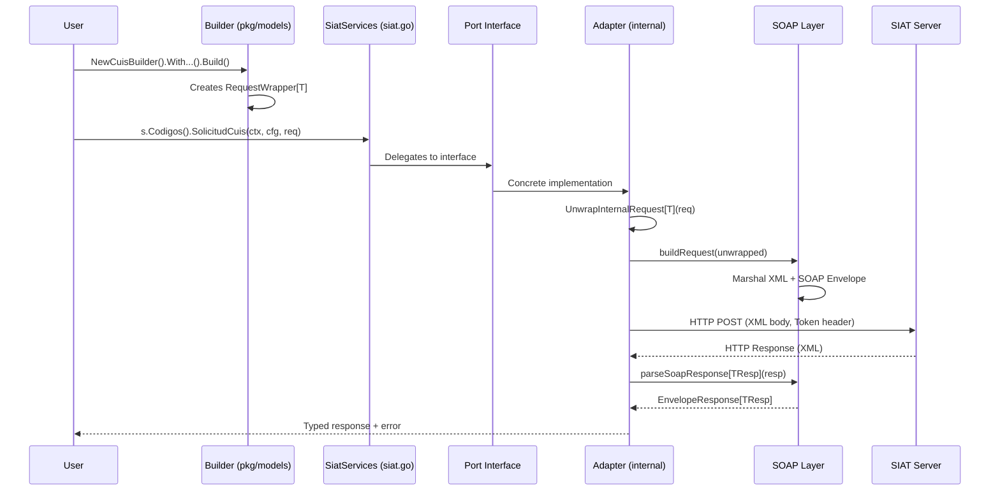

# Architecture

[← Back to Index](README.md)

> Deep dive into the internal architecture of `go-siat`. Essential for contributors and helpful for advanced users who want to understand how the SDK works under the hood.

---

## Table of Contents

1. [Overview](#overview)
2. [Hexagonal Architecture](#hexagonal-architecture)
3. [Layer Breakdown](#layer-breakdown)
4. [Design Patterns](#design-patterns)
5. [Request Lifecycle](#request-lifecycle)
6. [Directory Structure](#directory-structure)

---

## Overview

`go-siat` is built on **Hexagonal Architecture** (also known as Ports & Adapters), a design that cleanly separates business logic from infrastructure concerns. This makes the SDK testable, maintainable, and extensible.

The core principle: **the user interacts with public types in `pkg/` and root-level files, while all SOAP, HTTP, and XML complexity is hidden behind interfaces in `internal/`**.

---

## Hexagonal Architecture

```mermaid
graph TB
    subgraph "Public API (pkg/ + root)"
        A["siat.New()"] --> B["SiatServices"]
        B --> C["s.Codigos()"]
        B --> D["s.Sincronizacion()"]
        B --> E["s.Operaciones()"]
        B --> F["s.CompraVenta()"]
        B --> G["s.Electronica()"]
        B --> H["s.Computarizada()"]
        B --> I["s.DocumentoAjuste()"]
        B --> J["s.Telecomunicaciones()"]
        B --> K["s.ServicioBasico()"]
        B --> L["s.EntidadFinanciera()"]
        B --> M["s.BoletoAereo()"]
        B --> N["s.RecepcionCompras()"]
    end

    subgraph "Ports (internal/core/ports)"
        C --> P1["SiatCodigosService"]
        D --> P2["SiatSincronizacionService"]
        E --> P3["SiatOperacionesPort"]
        F --> P4["SiatCompraVentaService"]
        G --> P5["SiatElectronicaService"]
        H --> P6["SiatComputarizadaService"]
        I --> P7["SiatDocumentoAjusteService"]
        J --> P8["SiatTelecomunicacionesService"]
        K --> P9["SiatServicioBasicoService"]
        L --> P10["SiatEntidadFinancieraService"]
        M --> P11["SiatBoletoAereoService"]
        N --> P12["SiatRecepcionComprasService"]
    end

    subgraph "Adapters (internal/adapter/services)"
        P1 --> S1["siat_codigos_service.go"]
        P2 --> S2["siat_sincronizacion_service.go"]
        P3 --> S3["siat_operaciones_service.go"]
        P4 --> S4["siat_compra_venta_service.go"]
        P5 --> S5["siat_electronica_service.go"]
        P6 --> S6["siat_computarizada_service.go"]
        P7 --> S7["siat_documento_ajuste_service.go"]
        S8["siat_telecomunicaciones_service.go"]
        S9["siat_servicio_basico_service.go"]
        S10["siat_entidad_financiera_service.go"]
        S11["siat_boleto_aereo_service.go"]
        S12["siat_recepcion_compras_service.go"]
    end

    subgraph "Domain (internal/core/domain)"
        DOM["SOAP Types / SIAT Responses / Documents"]
    end

    S1 --> SOAP["SIAT SOAP Server"]
    S2 --> SOAP
    S3 --> SOAP
    S4 --> SOAP
    S5 --> SOAP
    S6 --> SOAP
    S7 --> SOAP
    S8 --> SOAP
    S9 --> SOAP
    S10 --> SOAP
    S11 --> SOAP
    S12 --> SOAP
```



---

## Layer Breakdown

### 1. Public API Layer (`siat.go`, `config.go`, `errors.go`, `middleware.go`, etc.)

The root package `siat` is the **entry point** for all users. It exposes:

| File | Responsibility |
|:-----|:---------------|
| `siat.go` | `SiatServices` struct, `New()` constructor, `Verify()` response validator, `Map` utility type |
| `config.go` | `Config` type alias (`Token`, `UserAgent`, `TraceId`) |
| `errors.go` | `SiatError` type alias + error factory functions |
| `constants.go` | Environment, modality, and emission type constants |
| `http_config.go` | `HTTPConfig` type alias + `DefaultHTTPConfig()` + `NewHTTPClient()` |
| `middleware.go` | `HTTPMiddleware` interface + `NewWithMiddleware()` |
| `codigos_errores.go` | All 150+ SIAT error codes with descriptions and classification helpers |

**Design decision**: Root-level files use **type aliases** (`type Config = ports.Config`) to expose internal types without leaking the `internal/` package path. This means users import `siat.Config` instead of `siat/internal/core/ports.Config`.

### 2. Public Models Layer (`pkg/models/`)

This layer contains the **Builder pattern** implementations that users interact with to construct requests:

| File | Responsibility |
|:-----|:---------------|
| `common.go` | `RequestWrapper[T]` — generic opaque wrapper for all request types |
| `codigos.go` | Builders for CUIS, CUFD, NIT verification, certificate revocation |
| `sincronizacion.go` | Builders for all 17 synchronization operations |
| `operaciones.go` | Builders for POS registration, significant events, closings |
| `compra_venta.go` | Builders for sales invoice operations |
| `computarizada.go` | Builders for computerized invoice operations |
| `electronica.go` | Builders for electronic invoice operations |
| `documento_ajuste.go` | Builders for adjustment document operations |
| `telecomunicaciones.go` | Builders for telecom sector operations |
| `servicio_basico.go` | Builders for basic services sector operations |
| `entidad_financiera.go` | Builders for financial entity operations |
| `boleto_aereo.go` | Builders for airline ticket operations |
| `recepcion_compras.go` | Builders for purchase reception operations |

**Design decision**: Requests use `RequestWrapper[T]` which is a public struct with a **private `request` field**. This makes it impossible for users to access or modify the internal SOAP types directly, enforcing type safety through the Builder pattern.

### 3. Public Models - Invoices (`pkg/models/invoices/`)

Contains **48 sector-specific invoice builders** with their domain models:

- Each sector has a Go file with `NewXxxCabeceraBuilder()`, `NewXxxDetalleBuilder()`, and `NewXxxBuilder()`.
- Each sector has a corresponding `_test.go` file with integration tests.
- The `factura_integration_test.go` file contains shared test infrastructure.

### 4. Public Utilities (`pkg/utils/`)

| File | Responsibility |
|:-----|:---------------|
| `signXML.go` | XML digital signing (PEM, P12, bytes), certificate validation |
| `cuf.go` | CUF (Código Único de Factura) generation with Mod11 algorithm |
| `encoding.go` | Gzip compression, Base64 encoding, TAR.GZ creation |
| `crypto.go` | SHA-256 and SHA-512 hex hashing |
| `parse.go` | Safe string→number parsing, pointer helpers |

### 5. Ports Layer (`internal/core/ports/`)

Ports define the **contracts** (interfaces) that adapters must implement:

| Port | Purpose |
|:-----|:--------|
| `SiatCodigosService` | CUIS/CUFD codes, NIT validation, certificate revocation |
| `SiatSincronizacionService` | Master catalog synchronization (17 operations) |
| `SiatOperacionesPort` | POS management, significant events, system closings |
| `SiatCompraVentaService` | Standard sales invoicing (Sector 1) |
| `SiatElectronicaService` | Electronic invoicing (with digital signature) |
| `SiatComputarizadaService` | Computerized invoicing (without digital signature) |
| `SiatDocumentoAjusteService` | Adjustment documents (credit/debit notes) |
| `SiatTelecomunicacionesService` | Telecommunications sector invoicing |
| `SiatServicioBasicoService` | Basic services sector invoicing |
| `SiatEntidadFinancieraService` | Financial entity sector invoicing |
| `SiatBoletoAereoService` | Airline ticket sector invoicing |
| `SiatRecepcionComprasService` | Purchase reception service |

The `Config` struct also lives here, containing `Token`, `UserAgent`, and `TraceId`.

### 6. Adapter Layer (`internal/adapter/services/`)

The adapter layer contains the **concrete implementations** of the ports:

| File | Key Element |
|:-----|:------------|
| `index_service.go` | Shared infrastructure: `buildRequest()`, `parseSoapResponse[T]()`, `performSoapRequest[TReq, TResp]()` |
| `http_config.go` | `HTTPConfig` struct, `DefaultHTTPConfig()`, `NewHTTPClient()` with TLS 1.2+ |
| `siat_*_service.go` | Each service implementation delegates to `performSoapRequest` |

### 7. Domain Layer (`internal/core/domain/`)

The deepest layer containing the pure data structures:

| Directory | Content |
|:----------|:--------|
| `datatype/soap/` | Generic SOAP envelope types (`Envelope[T]`, `EnvelopeResponse[T]`) |
| `datatype/` | Custom types: `NilableDate`, `NilableTime`, `NilableDecimal`, `SafeMath` |
| `siat/codigos/` | Response types for the Codigos service |
| `siat/sincronizacion/` | Response types for the Sincronizacion service |
| `siat/operaciones/` | Response types for the Operaciones service |
| `siat/facturacion/` | Shared response types for invoicing services |
| `siat/compra_venta/` | Sales-specific response types |
| `siat/documento_ajuste/` | Adjustment document response types |
| `siat/common/` | `Result` interface, `MensajeServicio` struct |
| `documents/` | XML domain models for all 48 invoice sectors |

---

## Design Patterns

### 1. Builder Pattern

Every request to the SIAT is constructed through a Builder. This ensures mandatory fields are set and provides a fluent API:

```go
req := models.Codigos().NewCuisBuilder().
    WithCodigoAmbiente(siat.AmbientePruebas).
    WithCodigoModalidad(siat.ModalidadElectronica).
    WithCodigoPuntoVenta(0).
    WithCodigoSucursal(0).
    WithCodigoSistema("ABC123DEF").
    WithNit(123456789).
    Build()
```

### 2. Opaque Request Wrapper

The `RequestWrapper[T]` pattern hides internal types from users:

```
User creates: models.Cuis                     (opaque, contains *T internally)
SDK unwraps:  models.UnwrapInternalRequest[T]  (extracts the *T)
SDK builds:   SOAP Envelope[T]                 (wraps in XML)
```

This pattern prevents users from depending on internal SOAP type structures, allowing the SDK to evolve its internals without breaking the public API.

### 3. Generic SOAP Infrastructure

The SDK uses Go generics extensively for SOAP handling:

```go
// Generic request builder
func performSoapRequest[TReq any, TResp any](
    ctx context.Context,
    httpClient *http.Client,
    url string,
    config ports.Config,
    opaqueReq any,
) (*soap.EnvelopeResponse[TResp], error)
```

This eliminates code duplication across all 80+ service methods.

### 4. Type-Safe Response Navigation

SOAP responses are fully typed using generics:

```go
resp, err := s.Codigos().SolicitudCuis(ctx, cfg, req)
// resp is *soap.EnvelopeResponse[codigos.CuisResponse]
// Navigate: resp.Body.Content.RespuestaCuis.Codigo
```

### 5. Middleware Chain

The HTTP middleware system follows the `http.RoundTripper` decorator pattern:

```
User Middleware → ... → Default Transport → SIAT Server
```

Middlewares wrap the transport layer, allowing interception of all HTTP requests without modifying the SDK.

---

## Request Lifecycle

The complete flow of a SIAT request from user call to response:



---

## Directory Structure

```
go-siat/
├── siat.go                          # Entry point: SiatServices, New(), Verify(), Map
├── config.go                        # Config type alias
├── constants.go                     # Environment, modality, emission constants
├── errors.go                        # SiatError type alias + factory functions
├── codigos_errores.go               # 150+ SIAT error codes + classification
├── http_config.go                   # HTTPConfig + NewHTTPClient()
├── middleware.go                     # HTTPMiddleware + NewWithMiddleware()
├── siat_test.go                     # End-to-end integration tests
│
├── pkg/                             # PUBLIC packages (user-facing)
│   ├── models/                      # Request builders
│   │   ├── common.go               # RequestWrapper[T] generic
│   │   ├── codigos.go              # Codes service builders
│   │   ├── sincronizacion.go       # Synchronization builders
│   │   ├── operaciones.go          # Operations builders
│   │   ├── compra_venta.go         # Sales builders
│   │   ├── computarizada.go        # Computerized builders
│   │   ├── electronica.go          # Electronic builders
│   │   ├── documento_ajuste.go     # Adjustment document builders
│   │   └── invoices/               # 48 sector-specific invoice builders + tests
│   │
│   └── utils/                       # Utility functions
│       ├── signXML.go              # XML digital signing
│       ├── cuf.go                  # CUF generation (Mod11)
│       ├── encoding.go            # Gzip, Base64, TAR.GZ
│       ├── crypto.go              # SHA-256, SHA-512
│       └── parse.go               # Safe parsing + pointer helpers
│
├── internal/                        # PRIVATE packages (SDK internals)
│   ├── adapter/services/            # Concrete service implementations
│   │   ├── index_service.go        # Shared SOAP infrastructure
│   │   ├── http_config.go          # HTTP client factory
│   │   └── siat_*_service.go       # 12 service implementations + tests
│   │
│   └── core/
│       ├── ports/                   # Interface contracts
│       │   ├── config.go           # Config struct
│       │   └── siat_*_port.go      # 12 service port interfaces
│       │
│       ├── domain/                  # Pure data structures
│       │   ├── datatype/           # SOAP envelopes, custom types
│       │   ├── siat/               # SIAT response types by service
│       │   └── documents/          # XML domain models (48 sectors)
│       │
│       └── middleware/              # HTTPMiddleware interface + chaining
│
├── docs/                            # Documentation
│   ├── en/                         # English
│   └── es/                         # Spanish
│
├── i18n/es/                         # Extended Spanish README
└── .github/                         # Contributing, Support, CoC, Logo
```

---

[← Back to Index](README.md) | [Next: Getting Started →](getting-started.md)
