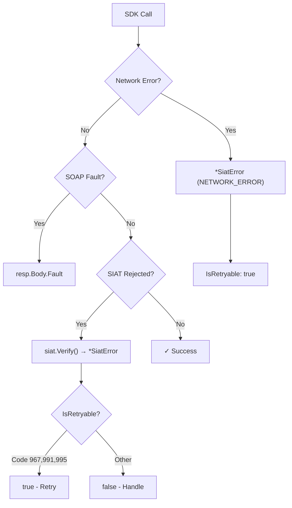

# Error Handling

[← Back to Index](README.md)

> Complete guide to understanding, handling, and recovering from errors in the `go-siat` SDK. Includes the full SIAT error code reference (150+ codes).

---

## Table of Contents

1. [Error Architecture](#error-architecture)
2. [SiatError Type](#siaterror-type)
3. [Error Factory Functions](#error-factory-functions)
4. [Response Verification](#response-verification)
5. [Error Classification](#error-classification)
6. [Retry Strategies](#retry-strategies)
7. [SIAT Error Code Reference](#siat-error-code-reference)

---

## Error Architecture

The SDK uses a three-level error hierarchy:



| Level | Source | Check Method |
|:------|:-------|:-------------|
| **Network/SDK** | Transport failures, timeouts | `err != nil` after service call |
| **SOAP Fault** | Server-level XML errors | `resp.Body.Fault != nil` |
| **SIAT Business** | Validation rejections, invalid data | `siat.Verify(resp.Body.Content.RespuestaXxx)` |

---

## SiatError Type

`SiatError` is the primary error type returned by the SDK:

```go
type SiatError struct {
    Code           string                 // "NETWORK_ERROR", "SIAT_SERVER_ERROR", "AUTH_FAILED", "TIMEOUT"
    Message        string                 // Human-readable description
    SiatCode       int                    // Numeric code from SIAT (0 if not applicable)
    StatusCode     int                    // HTTP status code (0 if not applicable)
    IsNetworkError bool                   // true for connectivity issues
    IsRetryable    bool                   // true if the operation can be retried
    Details        map[string]interface{} // Additional debugging context
    WrappedErr     error                  // Underlying error (for errors.Is/As)
}
```

### Usage with `errors.As`

```go
resp, err := s.Codigos().SolicitudCuis(ctx, cfg, req)
if err != nil {
    var siatErr *siat.SiatError
    if errors.As(err, &siatErr) {
        switch {
        case siat.IsNetworkError(err):
            log.Printf("Network issue: %s (retryable: %v)", siatErr.Message, siatErr.IsRetryable)
        case siatErr.Code == "AUTH_FAILED":
            log.Fatal("Invalid credentials - check your token")
        case siatErr.Code == "TIMEOUT":
            log.Printf("Request timed out - will retry")
        default:
            log.Printf("SIAT error [%d]: %s", siatErr.SiatCode, siatErr.Message)
        }
    }
    return err
}
```

---

## Error Factory Functions

The SDK provides factory functions for creating typed errors:

| Function | Code | IsNetwork | IsRetryable | Use Case |
|:---------|:-----|:----------|:------------|:---------|
| `siat.NewNetworkError(msg, err)` | `NETWORK_ERROR` | ✅ | ✅ | Connection refused, DNS failures |
| `siat.NewTimeoutError(msg)` | `TIMEOUT` | ✅ | ✅ | Request timeouts |
| `siat.NewSiatError(code, msg)` | `SIAT_SERVER_ERROR` | ❌ | ❌ | Server rejections |
| `siat.NewAuthError(msg)` | `AUTH_FAILED` | ❌ | ❌ | Invalid token/credentials |

### Helper Functions

| Function | Returns | Description |
|:---------|:--------|:------------|
| `siat.IsRetryable(err)` | `bool` | Whether the error suggests retrying |
| `siat.IsNetworkError(err)` | `bool` | Whether the error was a connectivity issue |
| `siat.GetMensaje(code)` | `string` | Human-readable description for a SIAT error code |
| `siat.IsRetryableCode(code)` | `bool` | Whether a SIAT code specifically suggests retrying (967, 991, 995, 999, 123) |
| `siat.IsValidationCode(code)` | `bool` | Whether the code indicates a data validation error |
| `siat.IsWarningCode(code)` | `bool` | Whether the code is a non-blocking warning |
| `siat.IsConfigCode(code)` | `bool` | Whether the code indicates a system configuration error |

---

## Response Verification

### `siat.Verify(response)`

The `Verify()` function inspects any SIAT response object and returns a `*SiatError` if the operation failed:

```go
resp, err := s.Codigos().SolicitudCuis(ctx, cfg, req)
if err != nil {
    return err // Network/transport error
}

// Check SOAP-level faults
if resp.Body.Fault != nil {
    return fmt.Errorf("SOAP fault: %s", resp.Body.Fault.String)
}

// Check SIAT business-level rejection
if err := siat.Verify(resp.Body.Content.RespuestaCuis); err != nil {
    return err // *SiatError with SIAT code and message
}

// ✓ Success - safe to use the response data
cuis := resp.Body.Content.RespuestaCuis.Codigo
```

### How `Verify` Works Internally

1. **Interface check**: If the response implements `common.Result`, uses `IsSuccess()` and `GetMessages()`.
2. **Reflection fallback**: Extracts `Transaccion` (bool) and `MensajesList` (slice) fields via reflection.
3. **Message classification**: Separates warnings (codes 2000–3008) from errors.
4. **Error construction**: Creates a `*SiatError` with the first error code and all messages concatenated.

> [!NOTE]
> Warning codes (2000-3008) do **not** cause `Verify` to return an error by themselves. Only if `Transaccion` is `false` or there are non-warning messages will it fail.

---

## Error Classification

### Code Ranges

| Range | Category | Description |
|:------|:---------|:------------|
| 123 | Tolerance | CUFD out of tolerance |
| 901–909 | Reception Status | Processing results (pending, rejected, processed, annulled) |
| 910–999 | Validation Errors | Invalid parameters, expired codes, unauthorized actions |
| 1000–1061 | XML/Invoice Errors | Data validation in invoice XML content |
| 2000–2019 | Warnings | Non-blocking warnings (correlative, NIT validation) |
| 3000–3010 | Configuration/Marks | Contract, quota, and control marks |

### Retryable Codes

These codes indicate temporary issues that may resolve on retry:

| Code | Description | Recommended Action |
|:-----|:------------|:-------------------|
| 123 | CUFD out of tolerance | Renew CUFD and retry |
| 967 | Database timeout | Wait 5-10s, then retry |
| 991 | Database error | Wait 5-10s, then retry |
| 995 | Service unavailable | Wait 30s, then retry |
| 999 | Service execution error | Wait 10s, then retry |

### Non-Retryable Codes (Require Action)

| Code | Description | Required Action |
|:-----|:------------|:----------------|
| 913 | CUIS invalid | Request new CUIS |
| 914 | CUFD invalid | Request new CUFD |
| 929 | CUIS expired | Request new CUIS |
| 953 | CUFD expired | Request new CUFD |
| 958 | Unauthorized user | Check API token |
| 989 | Invalid token | Obtain new token from SIAT portal |
| 939 | XML doesn't match XSD | Fix invoice structure |

---

## Retry Strategies

### Exponential Backoff Pattern

```go
func withRetry(maxAttempts int, operation func() error) error {
    var lastErr error
    for attempt := 0; attempt < maxAttempts; attempt++ {
        if attempt > 0 {
            backoff := time.Duration(math.Pow(2, float64(attempt-1))) * time.Second
            time.Sleep(backoff)
        }

        lastErr = operation()
        if lastErr == nil {
            return nil
        }

        // Don't retry non-retryable errors
        if !siat.IsRetryable(lastErr) {
            return lastErr
        }
    }
    return fmt.Errorf("failed after %d attempts: %w", maxAttempts, lastErr)
}
```

### Comprehensive Error Handling Pattern

```go
func sendInvoice(s *siat.SiatServices, cfg siat.Config, req models.RecepcionFacturaElectronica) error {
    ctx, cancel := context.WithTimeout(context.Background(), 45*time.Second)
    defer cancel()

    resp, err := s.Electronica().RecepcionFactura(ctx, cfg, req)

    // Level 1: Network/SDK error
    if err != nil {
        var siatErr *siat.SiatError
        if errors.As(err, &siatErr) {
            if siatErr.IsNetworkError {
                return fmt.Errorf("connectivity issue (retryable): %w", err)
            }
            return fmt.Errorf("SDK error [%s]: %w", siatErr.Code, err)
        }
        return err
    }

    // Level 2: SOAP fault
    if resp.Body.Fault != nil {
        return fmt.Errorf("SIAT SOAP fault: %s", resp.Body.Fault.String)
    }

    // Level 3: Business validation
    result := resp.Body.Content.RespuestaServicioFacturacion
    if err := siat.Verify(result); err != nil {
        var siatErr *siat.SiatError
        if errors.As(err, &siatErr) {
            code := siatErr.SiatCode
            switch {
            case siat.IsRetryableCode(code):
                return fmt.Errorf("temporary SIAT issue (retry): %w", err)
            case siat.IsValidationCode(code):
                return fmt.Errorf("invoice data invalid: %w", err)
            case siat.IsConfigCode(code):
                return fmt.Errorf("system configuration error: %w", err)
            default:
                return fmt.Errorf("SIAT rejected [%d]: %w", code, err)
            }
        }
        return err
    }

    return nil // ✓ Invoice accepted
}
```

---

## SIAT Error Code Reference

### Reception Status (901–909)

| Code | Constant | Description |
|:-----|:---------|:------------|
| 901 | `CodeRecepcionPendiente` | Reception Pending |
| 902 | `CodeRecepcionRechazada` | Reception Rejected |
| 903 | `CodeRecepcionProcesada` | Reception Processed |
| 904 | `CodeRecepcionObservada` | Reception Observed |
| 905 | `CodeAnulacionConfirmada` | Annulment Confirmed |
| 906 | `CodeAnulacionRechazada` | Annulment Rejected |
| 907 | `CodeReversionAnulacionConfirmada` | Annulment Reversal Confirmed |
| 908 | `CodeRecepcionValidada` | Reception Validated |
| 909 | `CodeReversionAnulacionRechazada` | Annulment Reversal Rejected |

### Parameter Validation (910–940)

| Code | Constant | Description |
|:-----|:---------|:------------|
| 910 | `CodeAmbienteInvalido` | Invalid environment parameter |
| 911 | `CodeCodigoSistemaInvalido` | Invalid system code |
| 912 | `CodeSistemaNoAsociadoAlContribuyente` | System not associated with taxpayer |
| 913 | `CodeCuisInvalido` | Invalid CUIS |
| 914 | `CodeCufdInvalido` | Invalid CUFD |
| 915 | `CodeTipoFacturaDocumentoInvalido` | Invalid invoice document type |
| 916 | `CodeTipoEmisionInvalido` | Invalid emission type |
| 917 | `CodeModalidadInvalida` | Invalid modality |
| 918 | `CodeSucursalInvalida` | Invalid branch |
| 919 | `CodeNitInvalido` | Invalid NIT |
| 920 | `CodeArchivoInvalido` | Invalid file |
| 921 | `CodeFirmadoXmlIncorrecto` | Incorrect XML signature |
| 922 | `CodeFirmaXmlNoCorrespondeAlContribuyente` | XML signature doesn't match taxpayer |
| 923 | `CodeCodigoRecepcionInvalido` | Invalid reception code |
| 924 | `CodeFacturaNoExisteEnSin` | Invoice doesn't exist in SIN database |
| 925 | `CodeMotivoAnulacionInvalido` | Invalid annulment reason |
| 926 | `CodeComunicacionExitosa` | Communication successful |
| 927 | `CodeCertificadoFirmaInvalido` | Invalid signing certificate |
| 928 | `CodeCertificadoRevocado` | Certificate is revoked |
| 929 | `CodeCuisNoVigente` | CUIS is expired |
| 930 | `CodeCuisNoCorrespondeASucursalPuntoVenta` | CUIS doesn't match branch/POS |
| 931 | `CodeCodigoDocumentoSectorInvalido` | Invalid sector document code |
| 932 | `CodeCodigoDocumentoSectorNoCorrespondeAlServicio` | Sector document doesn't match service |
| 933 | `CodePuntoVentaInexistenteOInvalido` | POS doesn't exist or is invalid |
| 934 | `CodeAnulacionFueraDePlazo` | Annulment request out of deadline |
| 935 | `CodeFechaEnvioInvalida` | Invalid send date |
| 936 | `CodeFacturaYaAnulada` | Invoice already annulled |
| 937 | `CodeNitNoAsociadoAModalidad` | NIT not associated with modality |
| 938 | `CodeNitPresentaMarcasDeControl` | NIT has control marks |
| 939 | `CodeFacturaNoCumpleXsd` | Invoice doesn't comply with XSD |
| 940 | `CodeNitNoHabilitadoDocumentoSector` | NIT not enabled for sector document |

### System and Operations (941–999)

| Code | Constant | Description |
|:-----|:---------|:------------|
| 941 | `CodeFacturaNoDisponibleParaAnular` | Invoice not available for annulment |
| 942 | `CodeEventoSignificativoNoExisteEnSin` | Significant event not in SIN database |
| 943 | `CodeFormatoFechaEnvioIncorrecto` | Incorrect send date format |
| 946 | `CodeCufNoExisteEnSin` | CUF doesn't exist in SIN database |
| 952 | `CodeCufYaRegistradoEnSin` | CUF already registered |
| 953 | `CodeCufdNoVigente` | CUFD expired |
| 958 | `CodeUsuarioNoAutorizado` | Unauthorized user |
| 967 | `CodeTiempoEsperaAgotadoDB` | Database timeout (**retryable**) |
| 968 | `CodeAnulacionYaRevertida` | Annulment already reversed |
| 970 | `CodeCuisVigenteNoPuedeSolicitarOtro` | Cannot request CUIS while current is active |
| 986 | `CodeNitActivo` | NIT Active |
| 987 | `CodeNitInactivo` | NIT Inactive |
| 989 | `CodeTokenInvalido` | Invalid Token |
| 991 | `CodeErrorBaseDeDatos` | Database Error (**retryable**) |
| 994 | `CodeNitInexistente` | NIT doesn't exist |
| 995 | `CodeServicioNoDisponible` | Service Unavailable (**retryable**) |
| 999 | `CodeErrorEjecucionServicio` | Service Execution Error (**retryable**) |

### Invoice XML Validation (1000–1061)

| Code | Constant | Description |
|:-----|:---------|:------------|
| 1000 | `CodeCufYaExisteEnSin` | CUF already exists in SIN |
| 1001 | `CodeNitNoCorrespondeACufd` | NIT in XML doesn't match CUFD |
| 1002 | `CodeCufInvalido` | Invalid CUF in XML |
| 1003 | `CodeCufdEnXmlInvalido` | Invalid CUFD in XML |
| 1004 | `CodeSucursalNoCorrespondeACufd` | Branch doesn't match CUFD |
| 1005 | `CodeFacturaNoPuedeSerEmitidaAlMismoEmisor` | Cannot invoice self |
| 1013 | `CodeCalculoMontoTotalErroneo` | Total amount calculation error |
| 1015 | `CodeCalculoImporteBaseErroneo` | Tax credit base calculation error |
| 1018 | `CodeCalculoSubtotalErroneo` | Subtotal calculation error |
| 1037 | `CodeNitNoValido` | NIT document number invalid |

### Warning Codes (2000–2019)

| Code | Constant | Description |
|:-----|:---------|:------------|
| 2000 | `CodeWarnCorrelatividadFactura` | Invoice number correlative warning |
| 2001 | `CodeWarnFechaRangoContingencia` | Emission date outside contingency range |
| 2005 | `CodeWarnNitClienteNoValido` | Client NIT is invalid |
| 2007 | `CodeWarnCalculoMontoTotal` | Total amount calculation warning |
| 2013 | `CodeWarnEmisionAMismoEmisor` | Self-invoicing warning |

### Contract and Control Marks (3000–3010)

| Code | Constant | Description |
|:-----|:---------|:------------|
| 3000 | `CodeNitNoContratoVigente` | NIT has no active contract |
| 3008 | `CodeWarnCuisExpira` | Warning: CUIS about to expire |
| 3010 | `CodeFacturaYaUtilizadaOConsolidada` | Invoice already used or consolidated |

> [!TIP]
> Use `siat.GetMensaje(code)` to get the official Spanish description for any code.

---

[← Back to Index](README.md) | [Next: Utilities →](utilities.md)
