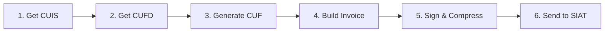

# Getting Started

[← Back to Index](README.md)

> This guide walks you through installing `go-siat`, setting up your environment, and making your first API call to Bolivia's SIAT tax system.

---

## Table of Contents

1. [Prerequisites](#prerequisites)
2. [Installation](#installation)
3. [Environment Setup](#environment-setup)
4. [Your First Call: Verify NIT](#your-first-call-verify-nit)
5. [Full Invoicing Flow](#full-invoicing-flow)
6. [Best Practices](#best-practices)

---

## Prerequisites

| Requirement | Details |
|:------------|:--------|
| **Go** | Version 1.25 or higher |
| **SIAT Credentials** | Token API, System Code, NIT - obtained from [Impuestos Nacionales](https://siat.impuestos.gob.bo/) |
| **Digital Certificate** | `.p12`/`.pfx` file + password (required for **Electronic** modality only) |
| **PEM Files** | `key.pem` + `cert.crt` (alternative to P12 for Electronic modality) |

> [!NOTE]
> For the **Computerized** modality, digital certificates are not required. You can start testing immediately with just your API token.

---

## Installation

```bash
go get github.com/ron86i/go-siat
```

This installs the SDK and its minimal dependencies:

| Dependency | Purpose |
|:-----------|:--------|
| `beevik/etree` | XML tree manipulation for digital signatures |
| `russellhaering/goxmldsig` | XMLDSig (Enveloped Signature) implementation |
| `golang.org/x/crypto` | PKCS12 certificate decoding |

---

## Environment Setup

Create a `.env` file in your project root with your SIAT credentials:

```env
# SIAT Connection
SIAT_URL=https://pilotosiatservicios.impuestos.gob.bo/v2
SIAT_TOKEN=your_api_token_here

# Taxpayer Information
SIAT_NIT=123456789
SIAT_CODIGO_AMBIENTE=2
SIAT_CODIGO_SISTEMA=ABC123DEF

# Certificate paths (for Electronic modality)
CERT_PATH=./cert.crt
KEY_PATH=./key.pem
P12_PATH=./cert.p12
P12_PASSWORD=your_password
```

| Variable | Description |
|:---------|:------------|
| `SIAT_URL` | Base URL. Use `piloto` for testing, `siat` for production |
| `SIAT_TOKEN` | Authentication token from the SIAT portal |
| `SIAT_NIT` | Your company's tax identification number |
| `SIAT_CODIGO_AMBIENTE` | `1` = Production, `2` = Testing |
| `SIAT_CODIGO_SISTEMA` | System code assigned by SIAT |

> [!WARNING]
> **Never commit your `.env` file to version control.** Add it to your `.gitignore`. The token and certificates are sensitive credentials.

---

## Your First Call: Verify NIT

The simplest operation is verifying if a NIT (tax number) is active:

```go
package main

import (
    "context"
    "fmt"
    "time"

    "github.com/ron86i/go-siat"
    "github.com/ron86i/go-siat/pkg/models"
)

func main() {
    // 1. Initialize the SDL client
    s, err := siat.New("https://pilotosiatservicios.impuestos.gob.bo/v2", nil)
    if err != nil {
        panic(err)
    }

    // 2. Configure authentication
    cfg := siat.Config{
        Token: "your_api_token",
    }

    // 3. Build the request using the Builder pattern
    req := models.Codigos().NewVerificarNitBuilder().
        WithNit(123456789).
        Build()

    // 4. Execute with a timeout context
    ctx, cancel := context.WithTimeout(context.Background(), 30*time.Second)
    defer cancel()

    resp, err := s.Codigos().VerificarNit(ctx, cfg, req)
    if err != nil {
        panic(err)
    }

    // 5. Check for SOAP faults
    if resp.Body.Fault != nil {
        fmt.Printf("SOAP Fault: %s\n", resp.Body.Fault.String)
        return
    }

    // 6. Validate the SIAT response
    if err := siat.Verify(resp.Body.Content.RespuestaVerificarNit); err != nil {
        fmt.Printf("SIAT rejected: %v\n", err)
        return
    }

    fmt.Println("✓ NIT is valid and active")
}
```

### Understanding the Response Structure

All SDK responses follow this SOAP envelope pattern:

```
resp.Body.Fault    → SOAP-level errors (nil if successful)
resp.Body.Content  → Service-specific response wrapper
  └── .RespuestaXxx  → The actual SIAT response data
      ├── .Transaccion   → bool (true = success)
      ├── .Codigo        → Response-specific data
      └── .MensajesList  → Array of messages/warnings
```

---

## Full Invoicing Flow

The complete electronic invoicing flow involves 6 steps:



### Step 1: Obtain CUIS (System Identification Code)

```go
cuisReq := models.Codigos().NewCuisBuilder().
    WithCodigoAmbiente(siat.AmbientePruebas).
    WithCodigoModalidad(siat.ModalidadElectronica).
    WithCodigoPuntoVenta(0).
    WithCodigoSucursal(0).
    WithCodigoSistema("ABC123DEF").
    WithNit(123456789).
    Build()

cuisResp, err := s.Codigos().SolicitudCuis(ctx, cfg, cuisReq)
cuis := cuisResp.Body.Content.RespuestaCuis.Codigo
```

### Step 2: Obtain CUFD (Daily Invoicing Code)

```go
cufdReq := models.Codigos().NewCufdBuilder().
    WithCodigoAmbiente(siat.AmbientePruebas).
    WithCodigoModalidad(siat.ModalidadElectronica).
    WithCodigoPuntoVenta(0).
    WithCodigoSucursal(0).
    WithCodigoSistema("ABC123DEF").
    WithNit(123456789).
    WithCuis(cuis).
    Build()

cufdResp, err := s.Codigos().SolicitudCufd(ctx, cfg, cufdReq)
cufd := cufdResp.Body.Content.RespuestaCufd.Codigo
cufdControl := cufdResp.Body.Content.RespuestaCufd.CodigoControl
```

### Step 3: Generate CUF (Unique Invoice Code)

```go
import "github.com/ron86i/go-siat/pkg/utils"

fechaEmision := time.Now()
cuf, err := utils.GenerarCUF(
    nit,           // NIT (13 digits)
    fechaEmision,  // Emission date/time
    0,             // Branch (sucursal)
    1,             // Modality (1=Electronic)
    1,             // Emission type (1=Online)
    1,             // Invoice type
    1,             // Sector document type
    1,             // Invoice number
    0,             // Point of sale
    cufdControl,   // Control code from CUFD
)
```

### Step 4: Build the Invoice

```go
import "github.com/ron86i/go-siat/pkg/models/invoices"

nombre := "CUSTOMER NAME"
cabecera := invoices.NewCompraVentaCabeceraBuilder().
    WithNitEmisor(nit).
    WithRazonSocialEmisor("MY COMPANY S.R.L.").
    WithMunicipio("La Paz").
    WithDireccion("Main Street 123").
    WithNumeroFactura(1).
    WithCuf(cuf).
    WithCufd(cufd).
    WithFechaEmision(fechaEmision).
    WithNombreRazonSocial(&nombre).
    WithMontoTotal(100).
    WithCodigoDocumentoSector(1).
    Build()

detalle := invoices.NewCompraVentaDetalleBuilder().
    WithActividadEconomica("477300").
    WithCodigoProductoSin(622539).
    WithDescripcion("PRODUCT DESCRIPTION").
    WithCantidad(1).
    WithPrecioUnitario(100).
    WithSubTotal(100).
    Build()

factura := invoices.NewCompraVentaBuilder().
    WithModalidad(siat.ModalidadElectronica).
    WithCabecera(cabecera).
    AddDetalle(detalle).
    Build()
```

### Step 5: Sign and Compress

```go
import "encoding/xml"

// Serialize to XML
xmlData, err := xml.Marshal(factura)

// Sign with digital certificate (Electronic modality only)
signedXML, err := utils.SignXML(xmlData, "key.pem", "cert.crt")
// Or with P12: utils.SignWithP12(xmlData, "cert.p12", "password")

// Compress and hash for transmission
hash, archivoBase64, err := utils.CompressAndHash(signedXML)
```

### Step 6: Send to SIAT

```go
recepcionReq := models.Electronica().NewRecepcionFacturaBuilder().
    WithCodigoAmbiente(siat.AmbientePruebas).
    WithNit(nit).
    WithCufd(cufd).
    WithCuis(cuis).
    WithTipoFacturaDocumento(1).
    WithArchivo(archivoBase64).
    WithFechaEnvio(fechaEmision).
    WithHashArchivo(hash).
    Build()

resp, err := s.Electronica().RecepcionFactura(ctx, cfg, recepcionReq)
```

---

## Best Practices

### Always Use Context Timeouts

```go
// ✅ Good: timeout prevents hanging requests
ctx, cancel := context.WithTimeout(context.Background(), 30*time.Second)
defer cancel()
resp, err := s.Codigos().SolicitudCuis(ctx, cfg, req)

// ❌ Bad: no timeout
resp, err := s.Codigos().SolicitudCuis(context.Background(), cfg, req)
```

### Verify SIAT Responses

Always check both the SOAP fault and the SIAT business response:

```go
resp, err := s.Codigos().SolicitudCuis(ctx, cfg, req)

// 1. Check network/SDK errors
if err != nil {
    if siat.IsRetryable(err) {
        // Retry logic
    }
    return err
}

// 2. Check SOAP-level faults
if resp.Body.Fault != nil {
    return fmt.Errorf("SOAP fault: %s", resp.Body.Fault.String)
}

// 3. Check SIAT business-level validation
if err := siat.Verify(resp.Body.Content.RespuestaCuis); err != nil {
    return err
}
```

### Renew CUFD Daily

The CUFD expires daily. Implement automatic renewal in your application:

```go
// Store CUFD with its expiration
type CUFDCache struct {
    Code       string
    Control    string
    ExpiresAt  time.Time
}

func (c *CUFDCache) IsValid() bool {
    return time.Now().Before(c.ExpiresAt)
}
```

### Reuse the SDK Client

Create `SiatServices` once and reuse it. The internal HTTP client manages connection pooling automatically:

```go
// ✅ Good: create once, reuse everywhere
s, _ := siat.New(baseURL, nil)

// ❌ Bad: creating new instances per request
for _, invoice := range invoices {
    s, _ := siat.New(baseURL, nil)
    s.Electronica().RecepcionFactura(ctx, cfg, req)
}
```

---

[← Back to Index](README.md) | [Next: API Reference →](api-reference.md)
