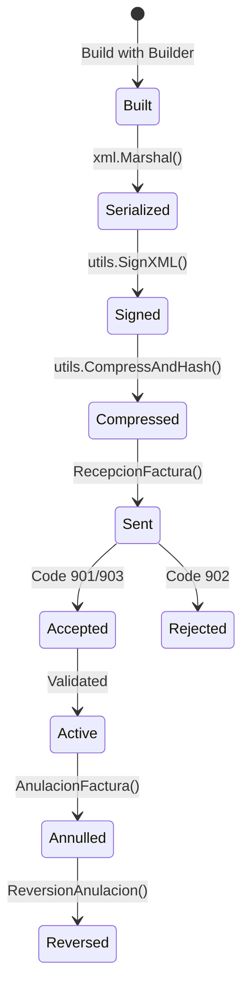

# Invoicing Guide

[← Back to Index](README.md)

> Comprehensive guide to building, signing, and sending invoices through the SIAT system. Covers the complete invoice lifecycle, all 48 regulatory sectors, digital signatures, and batch processing.

---

## Table of Contents

1. [Invoice Lifecycle](#invoice-lifecycle)
2. [Building Invoices](#building-invoices)
3. [Digital Signing](#digital-signing)
4. [Sending Invoices](#sending-invoices)
5. [Batch Processing](#batch-processing)
6. [Invoice Annulment](#invoice-annulment)
7. [Adjustment Documents](#adjustment-documents)
8. [Supported Sectors Reference](#supported-sectors-reference)

---

## Invoice Lifecycle

Every invoice in the SIAT system goes through a defined lifecycle:



| Stage | Function | Output |
|:------|:---------|:-------|
| **Build** | `invoices.NewXxxBuilder()` | Go struct |
| **Serialize** | `xml.Marshal(factura)` | XML bytes |
| **Sign** | `utils.SignXML(xml, key, cert)` | Signed XML bytes |
| **Compress** | `utils.CompressAndHash(signed)` | (hash, base64 string) |
| **Send** | `s.Electronica().RecepcionFactura()` | SIAT response |

---

## Building Invoices

Every invoice is composed of three parts built with the Builder pattern:

### 1. Cabecera (Header)

Contains the invoice metadata: emitter, dates, totals, CUF, CUFD.

```go
nombre := "CUSTOMER NAME"
cabecera := invoices.NewCompraVentaCabeceraBuilder().
    WithNitEmisor(123456789).
    WithRazonSocialEmisor("MY COMPANY S.R.L.").
    WithMunicipio("La Paz").
    WithDireccion("Main Street 123").
    WithTelefono("22445566").
    WithNumeroFactura(1).
    WithCuf(cuf).
    WithCufd(cufd).
    WithCodigoSucursal(0).
    WithFechaEmision(time.Now()).
    WithNombreRazonSocial(&nombre).
    WithCodigoTipoDocumentoIdentidad(1).
    WithNumeroDocumento("1234567").
    WithCodigoMetodoPago(1).
    WithMontoTotal(100.00).
    WithMontoTotalSujetoIva(100.00).
    WithCodigoMoneda(1).
    WithTipoCambio(1.00).
    WithMontoTotalMoneda(100.00).
    WithCodigoDocumentoSector(1).
    Build()
```

### 2. Detalle (Line Items)

One or more line items with product details:

```go
detalle := invoices.NewCompraVentaDetalleBuilder().
    WithActividadEconomica("477300").
    WithCodigoProductoSin(622539).
    WithCodigoProducto("PROD-001").
    WithDescripcion("Product Description").
    WithCantidad(2).
    WithUnidadMedida(1).
    WithPrecioUnitario(50.00).
    WithMontoDescuento(0).
    WithSubTotal(100.00).
    Build()
```

### 3. Invoice Assembly

Combine header + details into the final structure:

```go
factura := invoices.NewCompraVentaBuilder().
    WithModalidad(siat.ModalidadElectronica).  // or ModalidadComputarizada
    WithCabecera(cabecera).
    AddDetalle(detalle1).
    AddDetalle(detalle2).    // Multiple line items
    Build()
```

> [!TIP]
> Each sector has its own set of builders with sector-specific fields. For example, `NewHotelCabeceraBuilder()` includes `WithCantidadHuespedes()` and `WithTipoHabitacion()`.

---

## Digital Signing

Digital signatures are **required for Electronic modality** and **not required for Computerized modality**.

### Option 1: PEM Files (Key + Certificate)

```go
signedXML, err := utils.SignXML(xmlData, "key.pem", "cert.crt")
```

### Option 2: PEM Bytes (from database or vault)

```go
signedXML, err := utils.SignXMLBytes(xmlData, keyBytes, certBytes)
```

### Option 3: P12/PFX File

```go
signedXML, err := utils.SignWithP12(xmlData, "cert.p12", "password")
```

### Option 4: P12 Bytes (from database or vault)

```go
signedXML, err := utils.SignWithP12Bytes(xmlData, p12Data, "password")
```

### Certificate Validation

Before signing, you can verify your certificate hasn't expired:

```go
err := utils.VerifyP12Expiry(p12Data, "password")
if err != nil {
    // Certificate expired or not yet valid
}
```

> [!IMPORTANT]
> The SDK uses **RSA-SHA256** with **Enveloped Signature** (C14N 1.0 with Comments). These are the algorithms mandated by the SIAT.

---

## Sending Invoices

### Single Invoice (Online)

```go
// 1. Serialize and prepare
xmlData, _ := xml.Marshal(factura)
signedXML, _ := utils.SignXML(xmlData, "key.pem", "cert.crt")
hash, archivoBase64, _ := utils.CompressAndHash(signedXML)

// 2. Build send request
req := models.Electronica().NewRecepcionFacturaBuilder().
    WithCodigoAmbiente(siat.AmbientePruebas).
    WithNit(nit).
    WithCufd(cufd).
    WithCuis(cuis).
    WithTipoFacturaDocumento(1).
    WithCodigoDocumentoSector(1).
    WithCodigoEmision(siat.EmisionOnline).
    WithCodigoModalidad(siat.ModalidadElectronica).
    WithCodigoPuntoVenta(0).
    WithCodigoSucursal(0).
    WithCodigoSistema("ABC123").
    WithArchivo(archivoBase64).
    WithFechaEnvio(time.Now()).
    WithHashArchivo(hash).
    Build()

// 3. Send
resp, err := s.Electronica().RecepcionFactura(ctx, cfg, req)

// 4. Check response
estado := resp.Body.Content.RespuestaServicioFacturacion.CodigoEstado
// 901 = Pending, 902 = Rejected, 903 = Processed
```

---

## Batch Processing

### Package Sending (up to 500 invoices)

For contingency or offline scenarios, pack multiple invoices and send as a batch:

```go
req := models.Electronica().NewRecepcionPaqueteFacturaBuilder().
    WithCodigoAmbiente(siat.AmbientePruebas).
    // ... same auth fields
    WithArchivo(paqueteBase64).
    WithFechaEnvio(time.Now()).
    WithHashArchivo(hash).
    WithCantidadFacturas(150).
    WithCodigoEvento(eventCode).
    Build()

resp, err := s.Electronica().RecepcionPaqueteFactura(ctx, cfg, req)

// Later, validate the batch was processed
validReq := models.Electronica().NewValidacionRecepcionPaqueteFacturaBuilder().
    // ... auth fields + codigoRecepcion from previous response
    Build()

validResp, err := s.Electronica().ValidacionRecepcionPaqueteFactura(ctx, cfg, validReq)
```

### Massive Sending (501–2000 invoices)

For high-volume scenarios:

```go
req := models.Electronica().NewRecepcionMasivaFacturaBuilder().
    // ... same pattern, but for larger volumes
    Build()

resp, err := s.Electronica().RecepcionMasivaFactura(ctx, cfg, req)
```

| Sending Method | Min Invoices | Max Invoices | Use Case |
|:---------------|:-------------|:-------------|:---------|
| `RecepcionFactura` | 1 | 1 | Online, real-time |
| `RecepcionPaqueteFactura` | 1 | 500 | Contingency, offline |
| `RecepcionMasivaFactura` | 501 | 2000 | Daily/weekly bulk processing |

---

## Invoice Annulment

### Annulling an Invoice

```go
req := models.Electronica().NewAnulacionFacturaBuilder().
    WithCodigoAmbiente(siat.AmbientePruebas).
    WithNit(nit).
    WithCuis(cuis).
    WithCufd(cufd).
    WithCodigoDocumentoSector(1).
    WithCodigoEmision(siat.EmisionOnline).
    WithCodigoModalidad(siat.ModalidadElectronica).
    WithCodigoPuntoVenta(0).
    WithCodigoSucursal(0).
    WithCodigoSistema("ABC123").
    WithCodigoMotivo(1).             // See SincronizarParametricaMotivoAnulacion
    WithCuf(invoiceCUF).
    WithTipoFacturaDocumento(1).
    Build()

resp, err := s.Electronica().AnulacionFactura(ctx, cfg, req)
// Code 905 = Annulment confirmed
// Code 906 = Annulment rejected
```

### Reversing an Annulment

If an invoice was annulled by mistake, you can reverse it **once**:

```go
req := models.Electronica().NewReversionAnulacionFacturaBuilder().
    // ... same auth fields + CUF
    Build()

resp, err := s.Electronica().ReversionAnulacionFactura(ctx, cfg, req)
// Code 907 = Reversal confirmed
// Code 909 = Reversal rejected
```

> [!WARNING]
> Annulment reversal can only be performed **once per invoice**. A second attempt will be rejected with code 968.

---

## Adjustment Documents

Adjustment documents (Credit/Debit Notes, Conciliation Notes) handle billing corrections.

### Credit/Debit Notes

```go
// Build the adjustment document
cabecera := invoices.NewNotaCreditoDebitoCabeceraBuilder().
    // ... header fields including reference to original invoice
    Build()

detalle := invoices.NewNotaCreditoDebitoDetalleBuilder().
    // ... line items
    Build()

nota := invoices.NewNotaCreditoDebitoBuilder().
    WithModalidad(siat.ModalidadElectronica).
    WithCabecera(cabecera).
    AddDetalle(detalle).
    Build()

// Serialize, sign, compress (same as regular invoices)
xmlData, _ := xml.Marshal(nota)
signedXML, _ := utils.SignXML(xmlData, "key.pem", "cert.crt")
hash, archivo, _ := utils.CompressAndHash(signedXML)

// Send via DocumentoAjuste service
req := models.DocumentoAjuste().NewRecepcionDocumentoAjusteBuilder().
    // ... auth fields + archivo + hash
    Build()

resp, err := s.DocumentoAjuste().RecepcionDocumentoAjuste(ctx, cfg, req)
```

### Available Adjustment Document Types

| Type | Builder | Sector |
|:-----|:--------|:-------|
| Standard Credit/Debit Note | `NewNotaCreditoDebitoBuilder()` | 46 |
| ICE Credit/Debit Note | `NewNotaCreditoDebitoIceBuilder()` | 48 |
| Fiscal Credit/Debit Note | `NewNotaFiscalCreditoDebitoBuilder()` | 47 |
| Conciliation Note | `NewNotaConciliacionBuilder()` | 49 |

---

## Supported Sectors Reference

`go-siat` provides complete domain models, builders, and integration tests for all **48 regulatory sectors**:

### Standard and Services

| Sector | Builder Prefix | File | Test |
|:-------|:---------------|:-----|:-----|
| Sales | `CompraVenta` | `compra_venta.go` | `compra_venta_test.go` |
| Sales Bonuses | `CompraVentaBonificaciones` | `compra_venta_bonificaciones.go` | `compra_venta_bonificaciones_test.go` |
| Sales Fees | `CompraVentaTasas` | `compra_venta_tasas.go` | `compra_venta_tasas_test.go` |
| Real Estate Rental | `AlquilerBienInmueble` | `alquiler_bien_inmueble.go` | `alquiler_bien_inmueble_test.go` |
| Insurance | `Seguros` | `seguros.go` | `seguros_test.go` |
| Energy Supply | `SuministroEnergia` | `suministro_energia.go` | `suministro_energia_test.go` |
| Tourism & Lodging | `TurismoHospedaje` | `turismo_hospedaje.go` | `turismo_hospedaje_test.go` |
| Hotels | `Hotel` | `hotel.go` | `hotel_test.go` |
| Hospital & Clinics | `HospitalClinica` | `hospital_clinica.go` | `hospital_clinica_test.go` |
| Food Security | `SeguridadAlimentaria` | `seguridad_alimentaria.go` | `seguridad_alimentaria_test.go` |
| Financial Entities | `EntidadFinanciera` | `entidad_financiera.go` | `entidad_financiera_test.go` |
| Airline Tickets | `BoletoAereo` | `boleto_aereo.go` | `boleto_aereo_test.go` |
| Telecommunications | `Telecomunicaciones` | `telecomunicaciones.go` | `telecomunicaciones_test.go` |
| Basic Services | `ServicioBasico` | `servicio_basico.go` | `servicio_basico_test.go` |

### Export and Free Trade Zone

| Sector | Builder Prefix | File | Test |
|:-------|:---------------|:-----|:-----|
| Commercial Export | `ComercialExportacion` | `comercial_exportacion.go` | `comercial_exportacion_test.go` |
| Export Services | `ComercialExportacionServicio` | `comercial_exportacion_servicio.go` | `comercial_exportacion_servicio_test.go` |
| Export POS | `ComercialExportacionPuntoVenta` | `comercial_exportacion_punto_venta.go` | `comercial_exportacion_punto_venta_test.go` |
| Free Consignment | `LibreConsignacion` | `libre_consignacion.go` | `libre_consignacion_test.go` |
| Free Trade Zone | `ZonaFranca` | `zona_franca.go` | `zona_franca_test.go` |
| FTZ Rental | `AlquilerZonaFranca` | `alquiler_zona_franca.go` | `alquiler_zona_franca_test.go` |
| FTZ Hospital | `HospitalClinicaZonaFranca` | `hospital_clinica_zona_franca.go` | `hospital_clinica_zona_franca_test.go` |
| FTZ Telecommunications| `TelecomunicacionesZf` | `telecomunicaciones_zf.go` | `telecomunicaciones_zf_test.go` |
| FTZ Basic Services | `ServicioBasicoZf` | `servicio_basico_zf.go` | `servicio_basico_zf_test.go` |
| Duty Free | `DuttyFree` | `dutty_free.go` | `dutty_free_test.go` |

### Hydrocarbons and Energy

| Sector | Builder Prefix | File | Test |
|:-------|:---------------|:-----|:-----|
| Hydrocarbons | `ComercializacionHidrocarburos` | `comercializacion_hidrocarburos.go` | `comercializacion_hidrocarburos_test.go` |
| Export Hydrocarbons | `ComercialExportacionHidrocarburos` | `comercial_exportacion_hidrocarburos.go` | `comercial_exportacion_hidrocarburos_test.go` |
| Lubricants IEHD | `LubricantesIehd` | `lubricantes_iehd.go` | `lubricantes_iehd_test.go` |
| Lubricants Import | `ImportacionComercializacionLubricantes` | `importacion_comercializacion_lubricantes.go` | `importacion_comercializacion_lubricantes_test.go` |
| Bottling Plants | `Engarrafadoras` | `engarrafadoras.go` | `engarrafadoras_test.go` |
| GN/GLP | `ComercializacionGnGlp` | `comercializacion_gn_glp.go` | `comercializacion_gn_glp_test.go` |
| GNV | `ComercializacionGnv` | `comercializacion_gnv.go` | `comercializacion_gnv_test.go` |
| Unsubsidized Fuel | `VentaCombustibleSinSubvencion` | `venta_combustible_sin_subvencion.go` | `venta_combustible_sin_subvencion_test.go` |
| Biodiesel | `Biodiesel` | `biodiesel.go` | `biodiesel_test.go` |

### Mining and Metals

| Sector | Builder Prefix | File | Test |
|:-------|:---------------|:-----|:-----|
| Mineral Sales | `VentaMineral` | `venta_mineral.go` | `venta_mineral_test.go` |
| Export Mining | `ComercialExportacionMinera` | `comercial_exportacion_minera.go` | `comercial_exportacion_minera_test.go` |
| Sales to BCB | `VentaMineralBcb` | `venta_mineral_bcb.go` | `venta_mineral_bcb_test.go` |

### Education

| Sector | Builder Prefix | File | Test |
|:-------|:---------------|:-----|:-----|
| Education | `SectorEducativo` | `sector_educativo.go` | `sector_educativo_test.go` |
| Education (FTZ) | `SectorEducativoZonaFranca` | `sector_educativo_zona_franca.go` | `sector_educativo_zona_franca_test.go` |

### Adjustment Documents

| Sector | Builder Prefix | File | Test |
|:-------|:---------------|:-----|:-----|
| Credit/Debit Note | `NotaCreditoDebito` | `nota_credito_debito.go` | `nota_credito_debito_test.go` |
| Credit/Debit ICE | `NotaCreditoDebitoIce` | `nota_credito_debito_ice.go` | `nota_credito_debito_ice_test.go` |
| Fiscal Credit/Debit | `NotaFiscalCreditoDebito` | `nota_fiscal_credito_debito.go` | `nota_fiscal_credito_debito_test.go` |
| Conciliation Note | `NotaConciliacion` | `nota_conciliacion.go` | `nota_conciliacion_test.go` |

### Other Special Sectors

| Sector | Builder Prefix | File | Test |
|:-------|:---------------|:-----|:-----|
| Games of Chance | `JuegoAzar` | `juego_azar.go` | `juego_azar_test.go` |
| Zero Tax | `TasaCero` | `tasa_cero.go` | `tasa_cero_test.go` |
| ICE Products | `AlcanzadaIce` | `alcanzada_ice.go` | `alcanzada_ice_test.go` |
| Prevalued | `Prevalorada` | `prevalorada.go` | `prevalorada_test.go` |
| Prevalued No Tax Credit | `PrevaloradaSinDerechoCreditoFiscal` | `prevalorada_sin_derecho_credito_fiscal.go` | `prevalorada_sin_derecho_credito_fiscal_test.go` |
| Foreign Currency | `MonedaExtranjera` | `moneda_extranjera.go` | `moneda_extranjera_test.go` |

> [!TIP]
> All sector files are located in `pkg/models/invoices/`. Each test file demonstrates real integration with the SIAT pilot server and serves as living documentation.

---

[← Back to Index](README.md) | [Next: Error Handling →](error-handling.md)
