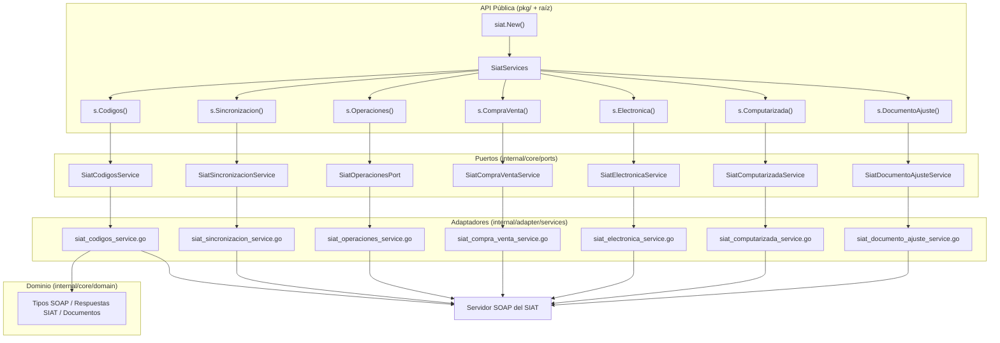
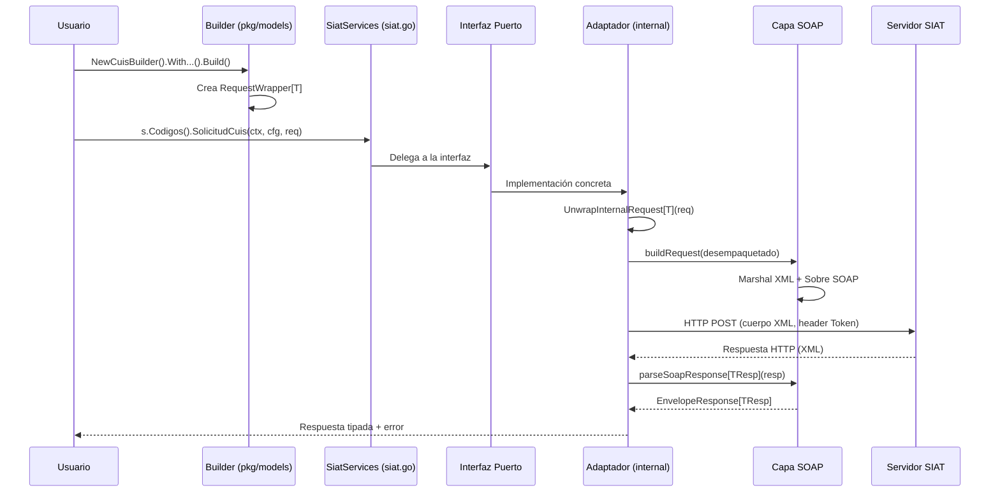

# Arquitectura

[← Volver al Índice](README.md)

> Este documento profundiza en la arquitectura interna de `go-siat`. Comprender estos patrones es esencial para contribuidores y útil para usuarios avanzados que desean entender cómo funciona el SDK internamente.

---

## Tabla de Contenidos

1. [Visión General](#visión-general)
2. [Arquitectura Hexagonal](#arquitectura-hexagonal)
3. [Desglose de Capas](#desglose-de-capas)
4. [Patrones de Diseño](#patrones-de-diseño)
5. [Ciclo de Vida de una Solicitud](#ciclo-de-vida-de-una-solicitud)
6. [Estructura de Directorios](#estructura-de-directorios)

---

## Visión General

`go-siat` está construido sobre **Arquitectura Hexagonal** (también conocida como Puertos y Adaptadores), un diseño que separa limpiamente la lógica de negocio de las preocupaciones de infraestructura. Esto hace que el SDK sea testeable, mantenible y extensible.

El principio central: **el usuario interactúa con tipos públicos en `pkg/` y archivos de nivel raíz, mientras toda la complejidad de SOAP, HTTP y XML se oculta detrás de interfaces en `internal/`**.

---

## Arquitectura Hexagonal



---

## Desglose de Capas

### 1. Capa de API Pública (`siat.go`, `config.go`, `errors.go`, `middleware.go`, etc.)

El paquete raíz `siat` es el **punto de entrada** para todos los usuarios. Expone:

| Archivo | Responsabilidad |
|:--------|:----------------|
| `siat.go` | Struct `SiatServices`, constructor `New()`, validador `Verify()`, tipo utilitario `Map` |
| `config.go` | Alias de tipo `Config` (Token, UserAgent, TraceId) |
| `errors.go` | Alias de tipo `SiatError` + funciones factory de errores |
| `constants.go` | Constantes de ambiente, modalidad y tipo de emisión |
| `http_config.go` | Alias de tipo `HTTPConfig` + `DefaultHTTPConfig()` + `NewHTTPClient()` |
| `middleware.go` | Interfaz `HTTPMiddleware` + `NewWithMiddleware()` |
| `codigos_errores.go` | Los 150+ códigos de error del SIAT con descripciones y helpers de clasificación |

**Decisión de diseño**: Los archivos de nivel raíz usan **alias de tipo** (`type Config = ports.Config`) para exponer tipos internos sin filtrar la ruta del paquete `internal/`. Esto permite que los usuarios importen `siat.Config` en vez de `siat/internal/core/ports.Config`.

### 2. Capa de Modelos Públicos (`pkg/models/`)

Esta capa contiene las implementaciones del **patrón Builder** con las que los usuarios interactúan para construir solicitudes:

| Archivo | Responsabilidad |
|:--------|:----------------|
| `common.go` | `RequestWrapper[T]` - envoltorio genérico opaco para todos los tipos de solicitud |
| `codigos.go` | Builders para CUIS, CUFD, verificación de NIT, revocación de certificado |
| `sincronizacion.go` | Builders para las 17 operaciones de sincronización |
| `operaciones.go` | Builders para registro de PV, eventos significativos, cierres |
| `compra_venta.go` | Builders para operaciones de facturación de compra-venta |
| `computarizada.go` | Builders para operaciones de facturación computarizada |
| `electronica.go` | Builders para operaciones de facturación electrónica |
| `documento_ajuste.go` | Builders para operaciones de documentos de ajuste |

**Decisión de diseño**: Las solicitudes usan `RequestWrapper[T]` que es un struct público con un **campo privado `request`**. Esto hace imposible que los usuarios accedan o modifiquen los tipos SOAP internos directamente, reforzando la seguridad de tipos a través del patrón Builder.

### 3. Modelos Públicos - Facturas (`pkg/models/invoices/`)

Contiene **48 builders específicos por sector** con sus modelos de dominio:

- Cada sector tiene un archivo Go con `NewXxxCabeceraBuilder()`, `NewXxxDetalleBuilder()` y `NewXxxBuilder()`.
- Cada sector tiene un archivo `_test.go` correspondiente con tests de integración.
- El archivo `factura_integration_test.go` contiene infraestructura compartida de tests.

### 4. Utilidades Públicas (`pkg/utils/`)

| Archivo | Responsabilidad |
|:--------|:----------------|
| `signXML.go` | Firma digital XML (PEM, P12, bytes), validación de certificados |
| `cuf.go` | Generación de CUF (Código Único de Factura) con algoritmo Mod11 |
| `encoding.go` | Compresión Gzip, codificación Base64, creación TAR.GZ |
| `crypto.go` | Hash SHA-256 y SHA-512 en hexadecimal |
| `parse.go` | Parseo seguro de string→número, helpers de punteros |

### 5. Capa de Puertos (`internal/core/ports/`)

Los puertos definen los **contratos** (interfaces) que los adaptadores deben implementar:

| Puerto | Métodos | Propósito |
|:-------|:--------|:----------|
| `SiatCodigosService` | 7 | Códigos CUIS/CUFD, validación de NIT, revocación de certificado |
| `SiatSincronizacionService` | 17 | Sincronización de catálogos maestros |
| `SiatOperacionesPort` | 8 | Gestión de puntos de venta, eventos significativos |
| `SiatCompraVentaService` | 10 | Facturación de compra-venta |
| `SiatElectronicaService` | 10 | Facturación electrónica (con firma digital) |
| `SiatComputarizadaService` | 10 | Facturación computarizada (sin firma digital) |
| `SiatDocumentoAjusteService` | 5 | Documentos de ajuste (notas crédito/débito) |

### 6. Capa de Adaptadores (`internal/adapter/services/`)

La capa de adaptadores contiene las **implementaciones concretas** de los puertos:

| Archivo | Elemento Clave |
|:--------|:---------------|
| `index_service.go` | Infraestructura compartida: `buildRequest()`, `parseSoapResponse[T]()`, `performSoapRequest[TReq, TResp]()` |
| `http_config.go` | Struct `HTTPConfig`, `DefaultHTTPConfig()`, `NewHTTPClient()` con TLS 1.2+ |
| `siat_*_service.go` | Cada implementación de servicio delega a `performSoapRequest` |

### 7. Capa de Dominio (`internal/core/domain/`)

La capa más profunda con las estructuras de datos puras:

| Directorio | Contenido |
|:-----------|:----------|
| `datatype/soap/` | Tipos genéricos de sobres SOAP (`Envelope[T]`, `EnvelopeResponse[T]`) |
| `datatype/` | Tipos personalizados: `NilableDate`, `NilableTime`, `NilableDecimal`, `SafeMath` |
| `siat/codigos/` | Tipos de respuesta para el servicio de Códigos |
| `siat/sincronizacion/` | Tipos de respuesta para el servicio de Sincronización |
| `siat/operaciones/` | Tipos de respuesta para el servicio de Operaciones |
| `siat/facturacion/` | Tipos de respuesta compartidos para servicios de facturación |
| `siat/compra_venta/` | Tipos de respuesta específicos de compra-venta |
| `siat/documento_ajuste/` | Tipos de respuesta de documentos de ajuste |
| `siat/common/` | Interfaz `Result`, struct `MensajeServicio` |
| `documents/` | Modelos de dominio XML para los 48+ sectores de facturación |

---

## Patrones de Diseño

### 1. Patrón Builder

Cada solicitud al SIAT se construye a través de un Builder. Esto asegura que los campos obligatorios estén establecidos y proporciona una API fluida:

```go
req := models.Codigos().NewCuisBuilder().
    WithCodigoAmbiente(siat.AmbientePruebas).
    WithCodigoModalidad(siat.ModalidadElectronica).
    WithCodigoPuntoVenta(0).
    WithCodigoSucursal(0).
    WithCodigoSistema("ABC123DEF").
    WithNit(123456789).
    Build()
```

### 2. Envoltorio de Solicitud Opaca

El patrón `RequestWrapper[T]` oculta los tipos internos del usuario:

```
El usuario crea: models.Cuis                     (opaco, contiene *T internamente)
El SDK desempaqueta: models.UnwrapInternalRequest[T]  (extrae el *T)
El SDK construye: SOAP Envelope[T]                 (envuelve en XML)
```

Este patrón previene que los usuarios dependan de estructuras de tipos SOAP internos, permitiendo que el SDK evolucione sus internos sin romper la API pública.

### 3. Infraestructura SOAP Genérica

El SDK usa genéricos de Go extensivamente para el manejo SOAP:

```go
func performSoapRequest[TReq any, TResp any](
    ctx context.Context,
    httpClient *http.Client,
    url string,
    config ports.Config,
    opaqueReq any,
) (*soap.EnvelopeResponse[TResp], error)
```

Esto elimina la duplicación de código a través de los 100+ métodos de servicio.

### 4. Navegación de Respuesta con Seguridad de Tipos

Las respuestas SOAP están completamente tipadas usando genéricos:

```go
resp, err := s.Codigos().SolicitudCuis(ctx, cfg, req)
// resp es *soap.EnvelopeResponse[codigos.CuisResponse]
// Navegar: resp.Body.Content.RespuestaCuis.Codigo
```

### 5. Cadena de Middleware

El sistema de middleware HTTP sigue el patrón decorador de `http.RoundTripper`:

```
Middleware del Usuario → ... → Transport por Defecto → Servidor SIAT
```

---

## Ciclo de Vida de una Solicitud

El flujo completo de una solicitud SIAT desde la llamada del usuario hasta la respuesta:



---

## Estructura de Directorios

```
go-siat/
├── siat.go                          # Punto de entrada: SiatServices, New(), Verify(), Map
├── config.go                        # Alias de tipo Config
├── constants.go                     # Constantes de ambiente, modalidad, emisión
├── errors.go                        # Alias de tipo SiatError + funciones factory
├── codigos_errores.go               # 150+ códigos de error del SIAT + clasificación
├── http_config.go                   # HTTPConfig + NewHTTPClient()
├── middleware.go                    # HTTPMiddleware + NewWithMiddleware()
├── siat_test.go                     # Tests de integración end-to-end
│
├── pkg/                             # Paquetes PÚBLICOS (orientados al usuario)
│   ├── models/                      # Builders de solicitudes
│   │   ├── common.go               # RequestWrapper[T] genérico
│   │   ├── codigos.go              # Builders del servicio de Códigos
│   │   ├── sincronizacion.go       # Builders de Sincronización
│   │   ├── operaciones.go          # Builders de Operaciones
│   │   ├── compra_venta.go         # Builders de Compra-Venta
│   │   ├── computarizada.go        # Builders de Computarizada
│   │   ├── electronica.go          # Builders de Electrónica
│   │   ├── documento_ajuste.go     # Builders de Documentos de Ajuste
│   │   └── invoices/               # 48 builders de facturas por sector + tests
│   │
│   └── utils/                       # Funciones utilitarias
│       ├── signXML.go              # Firma digital XML
│       ├── cuf.go                  # Generación de CUF (Mod11)
│       ├── encoding.go            # Gzip, Base64, TAR.GZ
│       ├── crypto.go              # SHA-256, SHA-512
│       └── parse.go               # Parseo seguro + helpers de punteros
│
├── internal/                        # Paquetes PRIVADOS (internos del SDK)
│   ├── adapter/services/            # Implementaciones concretas de servicios
│   └── core/
│       ├── ports/                   # Contratos de interfaz
│       ├── domain/                  # Estructuras de datos puras
│       ├── errors/                  # Tipo SiatError
│       └── middleware/              # Interfaz HTTPMiddleware + encadenamiento
│
├── docs/                            # Documentación
│   ├── en/                         # Inglés
│   └── es/                         # Español
│
├── i18n/es/                         # README extendido en español
└── .github/                         # Contribución, Soporte, CoC, Logo
```

---

[← Volver al Índice](README.md) | [Siguiente: Inicio Rápido →](inicio-rapido.md)
