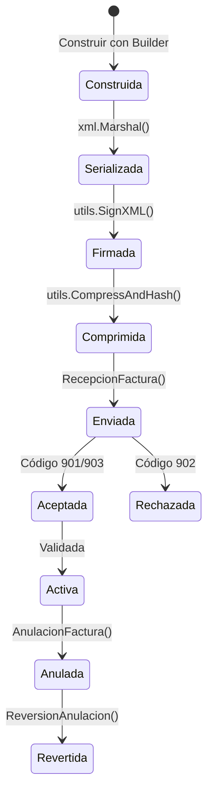

# Guía de Facturación

[← Volver al Índice](README.md)

> Guía completa para construir, firmar y enviar facturas a través del sistema SIAT. Cubre el ciclo de vida completo de la factura, los 35 sectores reglamentarios, firmas digitales y procesamiento masivo.

---

## Tabla de Contenidos

1. [Ciclo de Vida de la Factura](#ciclo-de-vida-de-la-factura)
2. [Construcción de Facturas](#construcción-de-facturas)
3. [Firma Digital](#firma-digital)
4. [Envío de Facturas](#envío-de-facturas)
5. [Procesamiento por Lotes](#procesamiento-por-lotes)
6. [Anulación de Facturas](#anulación-de-facturas)
7. [Documentos de Ajuste](#documentos-de-ajuste)
8. [Referencia de Sectores Soportados](#referencia-de-sectores-soportados)

---

## Ciclo de Vida de la Factura

Cada factura en el sistema SIAT pasa por un ciclo de vida definido:



| Etapa | Función | Salida |
|:------|:--------|:-------|
| **Construir** | `invoices.NewXxxBuilder()` | Struct de Go |
| **Serializar** | `xml.Marshal(factura)` | Bytes XML |
| **Firmar** | `utils.SignXML(xml, key, cert)` | Bytes XML firmados |
| **Comprimir** | `utils.CompressAndHash(signed)` | (hash, string base64) |
| **Enviar** | `s.Electronica().RecepcionFactura()` | Respuesta SIAT |

---

## Construcción de Facturas

Cada factura se compone de tres partes construidas con el patrón Builder:

### 1. Cabecera

Contiene los metadatos de la factura: emisor, fechas, totales, CUF, CUFD.

```go
nombre := "NOMBRE DEL CLIENTE"
cabecera := invoices.NewCompraVentaCabeceraBuilder().
    WithNitEmisor(123456789).
    WithRazonSocialEmisor("MI EMPRESA S.R.L.").
    WithMunicipio("La Paz").
    WithDireccion("Calle Principal 123").
    WithTelefono("22445566").
    WithNumeroFactura(1).
    WithCuf(cuf).
    WithCufd(cufd).
    WithCodigoSucursal(0).
    WithFechaEmision(time.Now()).
    WithNombreRazonSocial(&nombre).
    WithCodigoTipoDocumentoIdentidad(1).
    WithNumeroDocumento("1234567").
    WithCodigoMetodoPago(1).
    WithMontoTotal(100.00).
    WithMontoTotalSujetoIva(100.00).
    WithCodigoMoneda(1).
    WithTipoCambio(1.00).
    WithMontoTotalMoneda(100.00).
    WithCodigoDocumentoSector(1).
    Build()
```

### 2. Detalle (Líneas de Producto)

Una o más líneas con detalles de producto:

```go
detalle := invoices.NewCompraVentaDetalleBuilder().
    WithActividadEconomica("477300").
    WithCodigoProductoSin(622539).
    WithCodigoProducto("PROD-001").
    WithDescripcion("Descripción del Producto").
    WithCantidad(2).
    WithUnidadMedida(1).
    WithPrecioUnitario(50.00).
    WithMontoDescuento(0).
    WithSubTotal(100.00).
    Build()
```

### 3. Ensamblaje de la Factura

Combinar cabecera + detalles en la estructura final:

```go
factura := invoices.NewCompraVentaBuilder().
    WithModalidad(siat.ModalidadElectronica).
    WithCabecera(cabecera).
    AddDetalle(detalle1).
    AddDetalle(detalle2).    // Múltiples líneas de detalle
    Build()
```

> [!TIP]
> Cada sector tiene su propio conjunto de builders con campos específicos del sector. Por ejemplo, `NewHotelCabeceraBuilder()` incluye `WithCantidadHuespedes()` y `WithTipoHabitacion()`.

---

## Firma Digital

Las firmas digitales son **requeridas para modalidad Electrónica** y **no requeridas para modalidad Computarizada**.

### Opción 1: Archivos PEM (Clave + Certificado)

```go
signedXML, err := utils.SignXML(xmlData, "key.pem", "cert.crt")
```

### Opción 2: Bytes PEM (desde base de datos o vault)

```go
signedXML, err := utils.SignXMLBytes(xmlData, keyBytes, certBytes)
```

### Opción 3: Archivo P12/PFX

```go
signedXML, err := utils.SignWithP12(xmlData, "cert.p12", "contraseña")
```

### Opción 4: Bytes P12 (desde base de datos o vault)

```go
signedXML, err := utils.SignWithP12Bytes(xmlData, p12Data, "contraseña")
```

### Validación de Certificado

Antes de firmar, puedes verificar que tu certificado no haya expirado:

```go
err := utils.VerifyP12Expiry(p12Data, "contraseña")
if err != nil {
    // Certificado expirado o aún no válido
}
```

> [!IMPORTANT]
> El SDK usa **RSA-SHA256** con **Firma Envolvente** (C14N 1.0 con Comentarios). Estos son los algoritmos exigidos por el SIAT.

---

## Envío de Facturas

### Factura Individual (En Línea)

```go
// 1. Serializar y preparar
xmlData, _ := xml.Marshal(factura)
signedXML, _ := utils.SignXML(xmlData, "key.pem", "cert.crt")
hash, archivoBase64, _ := utils.CompressAndHash(signedXML)

// 2. Construir solicitud de envío
req := models.Electronica().NewRecepcionFacturaBuilder().
    WithCodigoAmbiente(siat.AmbientePruebas).
    WithNit(nit).
    WithCufd(cufd).
    WithCuis(cuis).
    WithTipoFacturaDocumento(1).
    WithArchivo(archivoBase64).
    WithFechaEnvio(time.Now()).
    WithHashArchivo(hash).
    Build()

// 3. Enviar
resp, err := s.Electronica().RecepcionFactura(ctx, cfg, req)

// 4. Verificar respuesta
estado := resp.Body.Content.RespuestaServicioFacturacion.CodigoEstado
// 901 = Pendiente, 902 = Rechazada, 903 = Procesada
```

---

## Procesamiento por Lotes

### Envío de Paquetes (hasta 500 facturas)

Para escenarios de contingencia u offline, empaqueta múltiples facturas y envía como lote:

```go
req := models.Electronica().NewRecepcionPaqueteFacturaBuilder().
    // ... campos de autenticación
    WithArchivo(paqueteBase64).
    WithCantidadFacturas(150).
    WithCodigoEvento(codigoEvento).
    Build()

resp, err := s.Electronica().RecepcionPaqueteFactura(ctx, cfg, req)
```

### Envío Masivo (501–2000 facturas)

Para escenarios de alto volumen:

```go
req := models.Electronica().NewRecepcionMasivaFacturaBuilder().
    // ... mismo patrón, para volúmenes mayores
    Build()

resp, err := s.Electronica().RecepcionMasivaFactura(ctx, cfg, req)
```

| Método de Envío | Mín Facturas | Máx Facturas | Caso de Uso |
|:----------------|:-------------|:-------------|:------------|
| `RecepcionFactura` | 1 | 1 | En línea, tiempo real |
| `RecepcionPaqueteFactura` | 1 | 500 | Contingencia, offline |
| `RecepcionMasivaFactura` | 501 | 2000 | Procesamiento masivo diario/semanal |

---

## Anulación de Facturas

### Anular una Factura

```go
req := models.Electronica().NewAnulacionFacturaBuilder().
    WithCodigoAmbiente(siat.AmbientePruebas).
    WithNit(nit).
    WithCuis(cuis).
    WithCufd(cufd).
    WithCodigoMotivo(1).
    WithCuf(cufFactura).
    WithTipoFacturaDocumento(1).
    Build()

resp, err := s.Electronica().AnulacionFactura(ctx, cfg, req)
// Código 905 = Anulación confirmada
// Código 906 = Anulación rechazada
```

### Revertir una Anulación

Si una factura fue anulada por error, puedes revertir **una sola vez**:

```go
req := models.Electronica().NewReversionAnulacionFacturaBuilder().
    // ... mismos campos de autenticación + CUF
    Build()

resp, err := s.Electronica().ReversionAnulacionFactura(ctx, cfg, req)
// Código 907 = Reversión confirmada
// Código 909 = Reversión rechazada
```

> [!WARNING]
> La reversión de anulación solo puede realizarse **una vez por factura**. Un segundo intento será rechazado con código 968.

---

## Documentos de Ajuste

Los documentos de ajuste (Notas de Crédito/Débito, Notas de Conciliación) manejan correcciones de facturación.

### Tipos de Documentos de Ajuste Disponibles

| Tipo | Builder | Sector |
|:-----|:--------|:-------|
| Nota Crédito/Débito Estándar | `NewNotaCreditoDebitoBuilder()` | 46 |
| Nota Crédito/Débito ICE | `NewNotaCreditoDebitoIceBuilder()` | 48 |
| Nota Fiscal Crédito/Débito | `NewNotaFiscalCreditoDebitoBuilder()` | 47 |
| Nota de Conciliación | `NewNotaConciliacionBuilder()` | 49 |

---

## Referencia de Sectores Soportados

`go-siat` proporciona modelos de dominio, builders y tests de integración para los **35 sectores** reglamentarios:

### Estándar y Servicios

| Sector | Prefijo Builder | Archivo |
|:-------|:---------------|:--------|
| Compra-Venta (Sector 1) | `CompraVenta` | `compra_venta.go` |
| Compra-Venta — Bonificaciones | `CompraVentaBonificaciones` | `compra_venta_bonificaciones.go` |
| Compra-Venta — Tasas | `CompraVentaTasas` | `compra_venta_tasas.go` |
| Alquiler de Bienes Inmuebles | `AlquilerBienInmueble` | `alquiler_bien_inmueble.go` |
| Seguros | `Seguros` | `seguros.go` |
| Suministro de Energía | `SuministroEnergia` | `suministro_energia.go` |
| Turismo y Hospedaje | `TurismoHospedaje` | `turismo_hospedaje.go` |
| Hoteles | `Hotel` | `hotel.go` |
| Hospitales y Clínicas | `HospitalClinica` | `hospital_clinica.go` |
| Seguridad Alimentaria | `SeguridadAlimentaria` | `seguridad_alimentaria.go` |
| Entidades Financieras | `EntidadFinanciera` | `entidad_financiera.go` |
| Boletos Aéreos | `BoletoAereo` | `boleto_aereo.go` |

### Exportación y Zona Franca

| Sector | Prefijo Builder | Archivo |
|:-------|:---------------|:--------|
| Exportación Comercial | `ComercialExportacion` | `comercial_exportacion.go` |
| Exportación de Servicios | `ComercialExportacionServicio` | `comercial_exportacion_servicio.go` |
| Exportación Punto de Venta | `ComercialExportacionPuntoVenta` | `comercial_exportacion_punto_venta.go` |
| Libre Consignación | `LibreConsignacion` | `libre_consignacion.go` |
| Zona Franca | `ZonaFranca` | `zona_franca.go` |
| Alquiler Zona Franca | `AlquilerZonaFranca` | `alquiler_zona_franca.go` |
| Hospital Zona Franca | `HospitalClinicaZonaFranca` | `hospital_clinica_zona_franca.go` |
| Duty Free | `DuttyFree` | `dutty_free.go` |

### Hidrocarburos y Energía

| Sector | Prefijo Builder | Archivo |
|:-------|:---------------|:--------|
| Hidrocarburos | `ComercializacionHidrocarburos` | `comercializacion_hidrocarburos.go` |
| Exportación Hidrocarburos | `ComercialExportacionHidrocarburos` | `comercial_exportacion_hidrocarburos.go` |
| Lubricantes (con IEHD) | `LubricantesIehd` | `lubricantes_iehd.go` |
| Importación Lubricantes | `ImportacionComercializacionLubricantes` | `importacion_comercializacion_lubricantes.go` |
| Engarrafadoras | `Engarrafadoras` | `engarrafadoras.go` |
| GN/GLP | `ComercializacionGnGlp` | `comercializacion_gn_glp.go` |
| GNV | `ComercializacionGnv` | `comercializacion_gnv.go` |
| Combustible Sin Subvención | `VentaCombustibleSinSubvencion` | `venta_combustible_sin_subvencion.go` |
| Biodiesel | `Biodiesel` | `biodiesel.go` |

### Minería y Metales

| Sector | Prefijo Builder | Archivo |
|:-------|:---------------|:--------|
| Venta de Minerales | `VentaMineral` | `venta_mineral.go` |
| Exportación Minera | `ComercialExportacionMinera` | `comercial_exportacion_minera.go` |
| Venta al BCB | `VentaMineralBcb` | `venta_mineral_bcb.go` |

### Educación

| Sector | Prefijo Builder | Archivo |
|:-------|:---------------|:--------|
| Sector Educativo | `SectorEducativo` | `sector_educativo.go` |
| Educativo Zona Franca | `SectorEducativoZonaFranca` | `sector_educativo_zona_franca.go` |

### Documentos de Ajuste

| Sector | Prefijo Builder | Archivo |
|:-------|:---------------|:--------|
| Nota Crédito/Débito | `NotaCreditoDebito` | `nota_credito_debito.go` |
| Nota Crédito/Débito ICE | `NotaCreditoDebitoIce` | `nota_credito_debito_ice.go` |
| Nota Fiscal Crédito/Débito | `NotaFiscalCreditoDebito` | `nota_fiscal_credito_debito.go` |
| Nota de Conciliación | `NotaConciliacion` | `nota_conciliacion.go` |

### Otros Sectores Especiales

| Sector | Prefijo Builder | Archivo |
|:-------|:---------------|:--------|
| Juegos de Azar | `JuegoAzar` | `juego_azar.go` |
| Tasa Cero | `TasaCero` | `tasa_cero.go` |
| Productos ICE | `AlcanzadaIce` | `alcanzada_ice.go` |
| Prevalorada | `Prevalorada` | `prevalorada.go` |
| Prevalorada (Sin Crédito Fiscal) | `PrevaloradaSinDerechoCreditoFiscal` | `prevalorada_sin_derecho_credito_fiscal.go` |
| Moneda Extranjera | `MonedaExtranjera` | `moneda_extranjera.go` |

> [!TIP]
> Todos los archivos de sectores están ubicados en `pkg/models/invoices/`. Cada archivo de test demuestra integración real con el servidor piloto del SIAT y sirve como documentación viviente.

---

[← Volver al Índice](README.md) | [Siguiente: Manejo de Errores →](manejo-errores.md)
