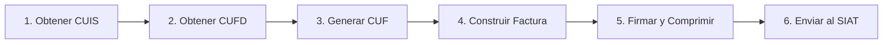

# Inicio Rápido

[← Volver al Índice](README.md)

> Esta guía te acompaña paso a paso para instalar `go-siat`, configurar tu ambiente y realizar tu primera llamada al sistema tributario SIAT de Bolivia.

---

## Tabla de Contenidos

1. [Prerrequisitos](#prerrequisitos)
2. [Instalación](#instalación)
3. [Configuración del Ambiente](#configuración-del-ambiente)
4. [Tu Primera Llamada: Verificar NIT](#tu-primera-llamada-verificar-nit)
5. [Flujo Completo de Facturación](#flujo-completo-de-facturación)
6. [Mejores Prácticas](#mejores-prácticas)

---

## Prerrequisitos

| Requisito | Detalles |
|:----------|:---------|
| **Go** | Versión 1.25 o superior |
| **Credenciales SIAT** | Token API, Código de Sistema, NIT — obtenidos de [Impuestos Nacionales](https://siat.impuestos.gob.bo/) |
| **Certificado Digital** | Archivo `.p12`/`.pfx` + contraseña (requerido solo para modalidad **Electrónica**) |
| **Archivos PEM** | `key.pem` + `cert.crt` (alternativa al P12 para modalidad Electrónica) |

> [!NOTE]
> Para la modalidad **Computarizada**, no se requieren certificados digitales. Puedes comenzar a hacer pruebas inmediatamente con solo tu token API.

---

## Instalación

```bash
go get github.com/ron86i/go-siat
```

Esto instala el SDK y sus dependencias mínimas:

| Dependencia | Propósito |
|:------------|:----------|
| `beevik/etree` | Manipulación de árboles XML para firmas digitales |
| `russellhaering/goxmldsig` | Implementación de XMLDSig (Firma Envolvente) |
| `golang.org/x/crypto` | Decodificación de certificados PKCS12 |

---

## Configuración del Ambiente

Crea un archivo `.env` en la raíz de tu proyecto con tus credenciales del SIAT:

```env
# Conexión SIAT
SIAT_URL=https://pilotosiatservicios.impuestos.gob.bo/v2
SIAT_TOKEN=tu_token_api_aqui

# Información del Contribuyente
SIAT_NIT=123456789
SIAT_CODIGO_AMBIENTE=2
SIAT_CODIGO_SISTEMA=ABC123DEF

# Rutas de certificados (para modalidad Electrónica)
CERT_PATH=./cert.crt
KEY_PATH=./key.pem
P12_PATH=./cert.p12
P12_PASSWORD=tu_contraseña
```

| Variable | Descripción |
|:---------|:------------|
| `SIAT_URL` | URL base. Usa `piloto` para pruebas, `siat` para producción |
| `SIAT_TOKEN` | Token de autenticación del portal SIAT |
| `SIAT_NIT` | NIT (Número de Identificación Tributaria) de tu empresa |
| `SIAT_CODIGO_AMBIENTE` | `1` = Producción, `2` = Pruebas |
| `SIAT_CODIGO_SISTEMA` | Código de sistema asignado por el SIAT |

> [!WARNING]
> **Nunca subas tu archivo `.env` al control de versiones.** Agrégalo a tu `.gitignore`. El token y los certificados son credenciales sensibles.

---

## Tu Primera Llamada: Verificar NIT

La operación más simple es verificar si un NIT (número tributario) está activo:

```go
package main

import (
    "context"
    "fmt"
    "time"

    "github.com/ron86i/go-siat"
    "github.com/ron86i/go-siat/pkg/models"
)

func main() {
    // 1. Inicializar el cliente del SDK
    s, err := siat.New("https://pilotosiatservicios.impuestos.gob.bo/v2", nil)
    if err != nil {
        panic(err)
    }

    // 2. Configurar autenticación
    cfg := siat.Config{
        Token: "tu_token_api",
    }

    // 3. Construir la solicitud usando el patrón Builder
    req := models.Codigos().NewVerificarNitBuilder().
        WithNit(123456789).
        Build()

    // 4. Ejecutar con contexto y timeout
    ctx, cancel := context.WithTimeout(context.Background(), 30*time.Second)
    defer cancel()

    resp, err := s.Codigos().VerificarNit(ctx, cfg, req)
    if err != nil {
        panic(err)
    }

    // 5. Verificar faults SOAP
    if resp.Body.Fault != nil {
        fmt.Printf("SOAP Fault: %s\n", resp.Body.Fault.String)
        return
    }

    // 6. Validar la respuesta del SIAT
    if err := siat.Verify(resp.Body.Content.RespuestaVerificarNit); err != nil {
        fmt.Printf("SIAT rechazó: %v\n", err)
        return
    }

    fmt.Println("✓ NIT es válido y está activo")
}
```

### Entendiendo la Estructura de Respuesta

Todas las respuestas del SDK siguen este patrón de sobre SOAP:

```
resp.Body.Fault    → Errores a nivel SOAP (nil si fue exitoso)
resp.Body.Content  → Envoltorio de respuesta específico del servicio
  └── .RespuestaXxx  → Los datos reales de respuesta del SIAT
      ├── .Transaccion   → bool (true = éxito)
      ├── .Codigo        → Datos específicos de la respuesta
      └── .MensajesList  → Array de mensajes/advertencias
```

---

## Flujo Completo de Facturación

El flujo completo de facturación electrónica involucra 6 pasos:



### Paso 1: Obtener CUIS (Código Único de Inicio de Sistemas)

```go
cuisReq := models.Codigos().NewCuisBuilder().
    WithCodigoAmbiente(siat.AmbientePruebas).
    WithCodigoModalidad(siat.ModalidadElectronica).
    WithCodigoPuntoVenta(0).
    WithCodigoSucursal(0).
    WithCodigoSistema("ABC123DEF").
    WithNit(123456789).
    Build()

cuisResp, err := s.Codigos().SolicitudCuis(ctx, cfg, cuisReq)
cuis := cuisResp.Body.Content.RespuestaCuis.Codigo
```

### Paso 2: Obtener CUFD (Código Único de Facturación Diaria)

```go
cufdReq := models.Codigos().NewCufdBuilder().
    WithCodigoAmbiente(siat.AmbientePruebas).
    WithCodigoModalidad(siat.ModalidadElectronica).
    WithCodigoPuntoVenta(0).
    WithCodigoSucursal(0).
    WithCodigoSistema("ABC123DEF").
    WithNit(123456789).
    WithCuis(cuis).
    Build()

cufdResp, err := s.Codigos().SolicitudCufd(ctx, cfg, cufdReq)
cufd := cufdResp.Body.Content.RespuestaCufd.Codigo
cufdControl := cufdResp.Body.Content.RespuestaCufd.CodigoControl
```

### Paso 3: Generar CUF (Código Único de Factura)

```go
import "github.com/ron86i/go-siat/pkg/utils"

fechaEmision := time.Now()
cuf, err := utils.GenerarCUF(
    nit,           // NIT (13 dígitos)
    fechaEmision,  // Fecha/hora de emisión
    0,             // Sucursal
    1,             // Modalidad (1=Electrónica)
    1,             // Tipo emisión (1=En línea)
    1,             // Tipo factura
    1,             // Tipo documento sector
    1,             // Número de factura
    0,             // Punto de venta
    cufdControl,   // Código de control del CUFD
)
```

### Paso 4: Construir la Factura

```go
import "github.com/ron86i/go-siat/pkg/models/invoices"

nombre := "NOMBRE DEL CLIENTE"
cabecera := invoices.NewCompraVentaCabeceraBuilder().
    WithNitEmisor(nit).
    WithRazonSocialEmisor("MI EMPRESA S.R.L.").
    WithMunicipio("La Paz").
    WithDireccion("Calle Principal 123").
    WithNumeroFactura(1).
    WithCuf(cuf).
    WithCufd(cufd).
    WithFechaEmision(fechaEmision).
    WithNombreRazonSocial(&nombre).
    WithMontoTotal(100).
    WithCodigoDocumentoSector(1).
    Build()

detalle := invoices.NewCompraVentaDetalleBuilder().
    WithActividadEconomica("477300").
    WithCodigoProductoSin(622539).
    WithDescripcion("DESCRIPCIÓN DEL PRODUCTO").
    WithCantidad(1).
    WithPrecioUnitario(100).
    WithSubTotal(100).
    Build()

factura := invoices.NewCompraVentaBuilder().
    WithModalidad(siat.ModalidadElectronica).
    WithCabecera(cabecera).
    AddDetalle(detalle).
    Build()
```

### Paso 5: Firmar y Comprimir

```go
import "encoding/xml"

// Serializar a XML
xmlData, err := xml.Marshal(factura)

// Firmar con certificado digital (solo modalidad Electrónica)
signedXML, err := utils.SignXML(xmlData, "key.pem", "cert.crt")
// O con P12: utils.SignWithP12(xmlData, "cert.p12", "contraseña")

// Comprimir y generar hash para transmisión
hash, archivoBase64, err := utils.CompressAndHash(signedXML)
```

### Paso 6: Enviar al SIAT

```go
recepcionReq := models.Electronica().NewRecepcionFacturaBuilder().
    WithCodigoAmbiente(siat.AmbientePruebas).
    WithNit(nit).
    WithCufd(cufd).
    WithCuis(cuis).
    WithTipoFacturaDocumento(1).
    WithArchivo(archivoBase64).
    WithFechaEnvio(fechaEmision).
    WithHashArchivo(hash).
    Build()

resp, err := s.Electronica().RecepcionFactura(ctx, cfg, recepcionReq)
```

---

## Mejores Prácticas

### Siempre Usar Contextos con Timeout

```go
// ✅ Correcto: el timeout previene solicitudes colgadas
ctx, cancel := context.WithTimeout(context.Background(), 30*time.Second)
defer cancel()
resp, err := s.Codigos().SolicitudCuis(ctx, cfg, req)

// ❌ Incorrecto: sin timeout
resp, err := s.Codigos().SolicitudCuis(context.Background(), cfg, req)
```

### Verificar Respuestas del SIAT

Siempre verificar tanto el fault SOAP como la respuesta de negocio del SIAT:

```go
resp, err := s.Codigos().SolicitudCuis(ctx, cfg, req)

// 1. Verificar errores de red/SDK
if err != nil {
    if siat.IsRetryable(err) {
        // Lógica de reintento
    }
    return err
}

// 2. Verificar faults a nivel SOAP
if resp.Body.Fault != nil {
    return fmt.Errorf("SOAP fault: %s", resp.Body.Fault.String)
}

// 3. Verificar validación de negocio del SIAT
if err := siat.Verify(resp.Body.Content.RespuestaCuis); err != nil {
    return err
}
```

### Renovar CUFD Diariamente

El CUFD expira diariamente. Implementa renovación automática en tu aplicación:

```go
type CUFDCache struct {
    Code      string
    Control   string
    ExpiresAt time.Time
}

func (c *CUFDCache) IsValid() bool {
    return time.Now().Before(c.ExpiresAt)
}
```

### Reutilizar el Cliente del SDK

Crea `SiatServices` una vez y reutilízalo. El cliente HTTP interno gestiona el pool de conexiones automáticamente:

```go
// ✅ Correcto: crear una vez, reutilizar en todas partes
s, _ := siat.New(baseURL, nil)

// ❌ Incorrecto: crear nuevas instancias por solicitud
for _, factura := range facturas {
    s, _ := siat.New(baseURL, nil)
    s.Electronica().RecepcionFactura(ctx, cfg, req)
}
```

---

[← Volver al Índice](README.md) | [Siguiente: Referencia de API →](referencia-api.md)
