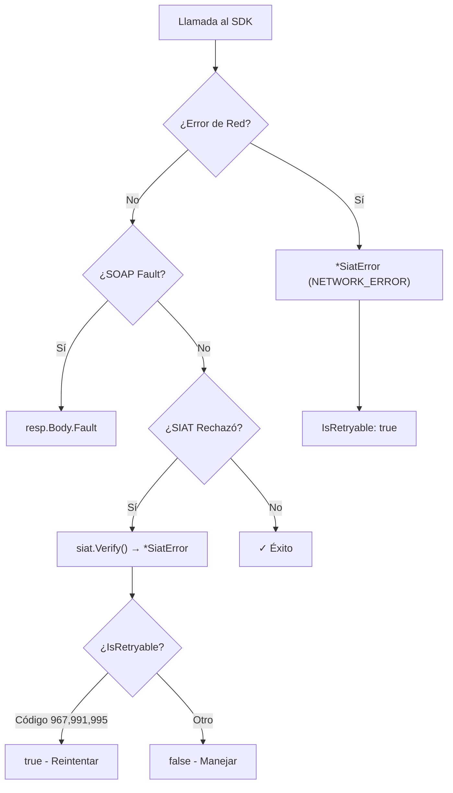

# Manejo de Errores

[← Volver al Índice](README.md)

> Guía completa para entender, manejar y recuperarse de errores en el SDK `go-siat`. Incluye la referencia completa de códigos de error del SIAT (150+ códigos).

---

## Tabla de Contenidos

1. [Arquitectura de Errores](#arquitectura-de-errores)
2. [Tipo SiatError](#tipo-siaterror)
3. [Funciones Factory de Errores](#funciones-factory-de-errores)
4. [Verificación de Respuestas](#verificación-de-respuestas)
5. [Clasificación de Errores](#clasificación-de-errores)
6. [Estrategias de Reintento](#estrategias-de-reintento)
7. [Referencia de Códigos de Error del SIAT](#referencia-de-códigos-de-error-del-siat)

---

## Arquitectura de Errores

El SDK usa una jerarquía de errores de tres niveles:



| Nivel | Origen | Método de Verificación |
|:------|:-------|:-----------------------|
| **Red/SDK** | Fallos de transporte, timeouts | `err != nil` después de la llamada |
| **SOAP Fault** | Errores XML a nivel de servidor | `resp.Body.Fault != nil` |
| **Negocio SIAT** | Rechazos de validación, datos inválidos | `siat.Verify(resp.Body.Content.RespuestaXxx)` |

---

## Tipo SiatError

`SiatError` es el tipo de error principal retornado por el SDK:

```go
type SiatError struct {
    Code           string                 // "NETWORK_ERROR", "SIAT_SERVER_ERROR", "AUTH_FAILED", "TIMEOUT"
    Message        string                 // Descripción legible por humanos
    SiatCode       int                    // Código numérico del SIAT (0 si no aplica)
    StatusCode     int                    // Código de estado HTTP (0 si no aplica)
    IsNetworkError bool                   // true para problemas de conectividad
    IsRetryable    bool                   // true si la operación puede reintentarse
    Details        map[string]interface{} // Contexto adicional para debugging
    WrappedErr     error                  // Error subyacente (para errors.Is/As)
}
```

### Uso con `errors.As`

```go
resp, err := s.Codigos().SolicitudCuis(ctx, cfg, req)
if err != nil {
    var siatErr *siat.SiatError
    if errors.As(err, &siatErr) {
        switch {
        case siat.IsNetworkError(err):
            log.Printf("Problema de red: %s (reintentable: %v)", siatErr.Message, siatErr.IsRetryable)
        case siatErr.Code == "AUTH_FAILED":
            log.Fatal("Credenciales inválidas - verifica tu token")
        case siatErr.Code == "TIMEOUT":
            log.Printf("Solicitud agotó tiempo - se reintentará")
        default:
            log.Printf("Error SIAT [%d]: %s", siatErr.SiatCode, siatErr.Message)
        }
    }
    return err
}
```

---

## Funciones Factory de Errores

| Función | Código | IsNetwork | IsRetryable | Caso de Uso |
|:--------|:-------|:----------|:------------|:------------|
| `siat.NewNetworkError(msg, err)` | `NETWORK_ERROR` | ✅ | ✅ | Conexión rechazada, fallos DNS |
| `siat.NewTimeoutError(msg)` | `TIMEOUT` | ✅ | ✅ | Timeouts de solicitud |
| `siat.NewSiatError(code, msg)` | `SIAT_SERVER_ERROR` | ❌ | ❌ | Rechazos del servidor |
| `siat.NewAuthError(msg)` | `AUTH_FAILED` | ❌ | ❌ | Token/credenciales inválidas |

### Funciones Helper

| Función | Retorna | Descripción |
|:--------|:--------|:------------|
| `siat.IsRetryable(err)` | `bool` | Si el error sugiere reintentar |
| `siat.IsNetworkError(err)` | `bool` | Si fue un problema de conectividad |
| `siat.GetMensaje(code)` | `string` | Descripción legible para un código de error del SIAT |
| `siat.IsRetryableCode(code)` | `bool` | Si un código SIAT sugiere reintento (967, 991, 995, 999, 123) |
| `siat.IsValidationCode(code)` | `bool` | Si el código indica un error de validación de datos |
| `siat.IsWarningCode(code)` | `bool` | Si el código es una advertencia no bloqueante |
| `siat.IsConfigCode(code)` | `bool` | Si el código indica un error de configuración del sistema |

---

## Verificación de Respuestas

### `siat.Verify(response)`

La función `Verify()` inspecciona cualquier objeto de respuesta del SIAT y retorna un `*SiatError` si la operación falló:

```go
resp, err := s.Codigos().SolicitudCuis(ctx, cfg, req)
if err != nil {
    return err // Error de red/transporte
}

// Verificar faults a nivel SOAP
if resp.Body.Fault != nil {
    return fmt.Errorf("SOAP fault: %s", resp.Body.Fault.String)
}

// Verificar rechazo a nivel de negocio del SIAT
if err := siat.Verify(resp.Body.Content.RespuestaCuis); err != nil {
    return err // *SiatError con código y mensaje del SIAT
}

// ✓ Éxito - seguro usar los datos de respuesta
cuis := resp.Body.Content.RespuestaCuis.Codigo
```

> [!NOTE]
> Los códigos de advertencia (2000-3008) **no** causan que `Verify` retorne un error por sí solos. Solo si `Transaccion` es `false` o hay mensajes que no son advertencias, retornará error.

---

## Clasificación de Errores

### Rangos de Códigos

| Rango | Categoría | Descripción |
|:------|:----------|:------------|
| 123 | Tolerancia | CUFD fuera de tolerancia |
| 901–909 | Estado de Recepción | Resultados de procesamiento |
| 910–999 | Errores de Validación | Parámetros inválidos, códigos expirados |
| 1000–1061 | Errores XML/Factura | Validación de datos en el contenido XML |
| 2000–2019 | Advertencias | Advertencias no bloqueantes |
| 3000–3010 | Configuración/Marcas | Contrato, cuotas y marcas de control |

### Códigos Reintentables

| Código | Descripción | Acción Recomendada |
|:-------|:------------|:-------------------|
| 123 | CUFD fuera de tolerancia | Renovar CUFD y reintentar |
| 967 | Timeout de base de datos | Esperar 5-10s, luego reintentar |
| 991 | Error de base de datos | Esperar 5-10s, luego reintentar |
| 995 | Servicio no disponible | Esperar 30s, luego reintentar |
| 999 | Error de ejecución del servicio | Esperar 10s, luego reintentar |

### Códigos No Reintentables (Requieren Acción)

| Código | Descripción | Acción Requerida |
|:-------|:------------|:-----------------|
| 913 | CUIS inválido | Solicitar nuevo CUIS |
| 914 | CUFD inválido | Solicitar nuevo CUFD |
| 929 | CUIS expirado | Solicitar nuevo CUIS |
| 953 | CUFD expirado | Solicitar nuevo CUFD |
| 958 | Usuario no autorizado | Verificar token API |
| 989 | Token inválido | Obtener nuevo token del portal SIAT |
| 939 | XML no cumple XSD | Corregir estructura de factura |

---

## Estrategias de Reintento

### Patrón de Backoff Exponencial

```go
func conReintentos(maxIntentos int, operacion func() error) error {
    var ultimoErr error
    for intento := 0; intento < maxIntentos; intento++ {
        if intento > 0 {
            backoff := time.Duration(math.Pow(2, float64(intento-1))) * time.Second
            time.Sleep(backoff)
        }

        ultimoErr = operacion()
        if ultimoErr == nil {
            return nil
        }

        // No reintentar errores no reintentables
        if !siat.IsRetryable(ultimoErr) {
            return ultimoErr
        }
    }
    return fmt.Errorf("falló después de %d intentos: %w", maxIntentos, ultimoErr)
}
```

### Patrón Completo de Manejo de Errores

```go
func enviarFactura(s *siat.SiatServices, cfg siat.Config, req models.RecepcionFacturaElectronica) error {
    ctx, cancel := context.WithTimeout(context.Background(), 45*time.Second)
    defer cancel()

    resp, err := s.Electronica().RecepcionFactura(ctx, cfg, req)

    // Nivel 1: Error de red/SDK
    if err != nil {
        var siatErr *siat.SiatError
        if errors.As(err, &siatErr) {
            if siatErr.IsNetworkError {
                return fmt.Errorf("problema de conectividad (reintentable): %w", err)
            }
            return fmt.Errorf("error SDK [%s]: %w", siatErr.Code, err)
        }
        return err
    }

    // Nivel 2: SOAP fault
    if resp.Body.Fault != nil {
        return fmt.Errorf("SIAT SOAP fault: %s", resp.Body.Fault.String)
    }

    // Nivel 3: Validación de negocio
    result := resp.Body.Content.RespuestaServicioFacturacion
    if err := siat.Verify(result); err != nil {
        var siatErr *siat.SiatError
        if errors.As(err, &siatErr) {
            code := siatErr.SiatCode
            switch {
            case siat.IsRetryableCode(code):
                return fmt.Errorf("problema temporal SIAT (reintentar): %w", err)
            case siat.IsValidationCode(code):
                return fmt.Errorf("datos de factura inválidos: %w", err)
            case siat.IsConfigCode(code):
                return fmt.Errorf("error de configuración del sistema: %w", err)
            default:
                return fmt.Errorf("SIAT rechazó [%d]: %w", code, err)
            }
        }
        return err
    }

    return nil // ✓ Factura aceptada
}
```

---

## Referencia de Códigos de Error del SIAT

### Estado de Recepción (901–909)

| Código | Constante | Descripción |
|:-------|:----------|:------------|
| 901 | `CodeRecepcionPendiente` | Recepción Pendiente |
| 902 | `CodeRecepcionRechazada` | Recepción Rechazada |
| 903 | `CodeRecepcionProcesada` | Recepción Procesada |
| 904 | `CodeRecepcionObservada` | Recepción Observada |
| 905 | `CodeAnulacionConfirmada` | Anulación Confirmada |
| 906 | `CodeAnulacionRechazada` | Anulación Rechazada |
| 907 | `CodeReversionAnulacionConfirmada` | Reversión de Anulación Confirmada |
| 908 | `CodeRecepcionValidada` | Recepción Validada |
| 909 | `CodeReversionAnulacionRechazada` | Reversión de Anulación Rechazada |

### Validación de Parámetros (910–940)

| Código | Constante | Descripción |
|:-------|:----------|:------------|
| 910 | `CodeAmbienteInvalido` | El parámetro ambiente es inválido |
| 911 | `CodeCodigoSistemaInvalido` | El código de sistema es inválido |
| 913 | `CodeCuisInvalido` | CUIS inválido |
| 914 | `CodeCufdInvalido` | CUFD inválido |
| 919 | `CodeNitInvalido` | NIT inválido |
| 921 | `CodeFirmadoXmlIncorrecto` | El firmado del XML es incorrecto |
| 927 | `CodeCertificadoFirmaInvalido` | El certificado de firma es inválido |
| 929 | `CodeCuisNoVigente` | El CUIS no está vigente |
| 939 | `CodeFacturaNoCumpleXsd` | La factura no cumple con el formato XSD |

### Sistema y Operaciones (941–999)

| Código | Constante | Descripción |
|:-------|:----------|:------------|
| 953 | `CodeCufdNoVigente` | CUFD no vigente |
| 958 | `CodeUsuarioNoAutorizado` | Usuario no autorizado |
| 967 | `CodeTiempoEsperaAgotadoDB` | Timeout de base de datos (**reintentable**) |
| 968 | `CodeAnulacionYaRevertida` | Anulación ya revertida |
| 986 | `CodeNitActivo` | NIT Activo |
| 987 | `CodeNitInactivo` | NIT Inactivo |
| 989 | `CodeTokenInvalido` | Token Inválido |
| 991 | `CodeErrorBaseDeDatos` | Error de Base de Datos (**reintentable**) |
| 995 | `CodeServicioNoDisponible` | Servicio No Disponible (**reintentable**) |
| 999 | `CodeErrorEjecucionServicio` | Error de Ejecución del Servicio (**reintentable**) |

### Validación XML de Factura (1000–1061)

| Código | Constante | Descripción |
|:-------|:----------|:------------|
| 1000 | `CodeCufYaExisteEnSin` | El CUF ya existe en el SIN |
| 1001 | `CodeNitNoCorrespondeACufd` | El NIT en el XML no corresponde al CUFD |
| 1002 | `CodeCufInvalido` | CUF inválido en el XML |
| 1013 | `CodeCalculoMontoTotalErroneo` | Error en el cálculo del monto total |
| 1018 | `CodeCalculoSubtotalErroneo` | Error en el cálculo del subtotal |
| 1037 | `CodeNitNoValido` | Número de documento NIT no válido |

### Códigos de Advertencia (2000–2019)

| Código | Constante | Descripción |
|:-------|:----------|:------------|
| 2000 | `CodeWarnCorrelatividadFactura` | Advertencia de correlatividad de factura |
| 2005 | `CodeWarnNitClienteNoValido` | NIT del cliente no válido |
| 2007 | `CodeWarnCalculoMontoTotal` | Advertencia de cálculo de monto total |

### Marcas de Contrato y Control (3000–3010)

| Código | Constante | Descripción |
|:-------|:----------|:------------|
| 3000 | `CodeNitNoContratoVigente` | NIT no tiene contrato vigente |
| 3008 | `CodeWarnCuisExpira` | Advertencia: El CUIS está por expirar |
| 3010 | `CodeFacturaYaUtilizadaOConsolidada` | Factura ya utilizada o consolidada |

> [!TIP]
> Usa `siat.GetMensaje(code)` para obtener la descripción oficial en español de cualquier código.

---

[← Volver al Índice](README.md) | [Siguiente: Utilidades →](utilidades.md)
